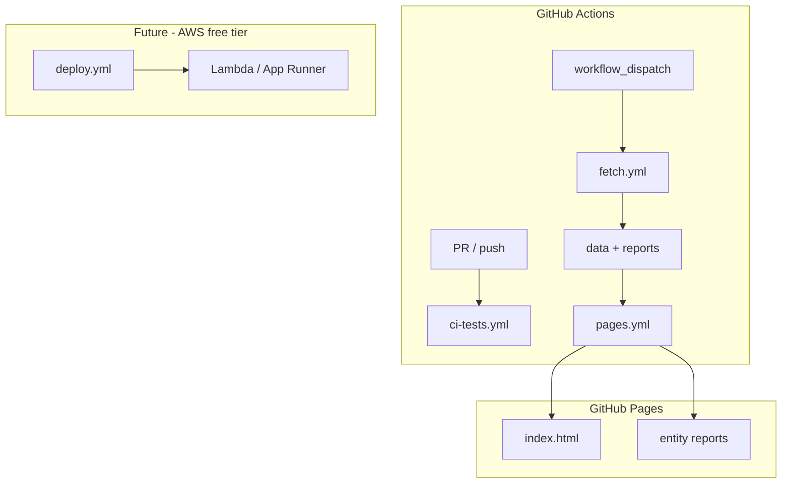

# Plan: CI, Reporting Site & Deployment Infrastructure

## Goal

Establish reliable automation around testing, visibility into fetch runs, and (eventually) free hosting — so the project can grow through PRs without manual babysitting.

## Current Foundation

| Area | Today |
|------|-------|
| **CI** | `.github/workflows/ci-tests.yml` runs `go test -v ./...` on push/PR (Go 1.23, `robherley/go-test-action`) |
| **Secrets** | `.env` gitignored; CI does not need IGDB credentials (tests use mocks) |
| **Data** | `data/` gitignored — fetch artifacts are local only |
| **Reports** | Per-entity HTML in `data/<entity>-report.html` (generated at fetch time, not published) |
| **Deployment** | None |
| **Issue tracking** | README TODO list inline; no GitHub Issues workflow |

README TODO items this plan addresses:

- Unit tests on PRs/commits (partially done)
- GitHub Issues for TODOs/bugs
- Fetch report site on GitHub Pages
- Free AWS deployment via GitHub Actions

## Design Principles

- **100% free tier** — GitHub Actions, GitHub Pages, AWS free tier only
- **No secrets in CI logs** — fetch workflows use GitHub Secrets; never echo credentials
- **CI stays fast** — default workflow remains mock-based unit tests; heavy fetch is scheduled/manual
- **Incremental adoption** — each milestone is independently useful

## Proposed Architecture



---

## Phase 1 — CI Hardening (Extend Existing)

### 1.1 Expand `ci-tests.yml`

Add steps beyond bare `go test`:

| Step | Command | Purpose |
|------|---------|---------|
| Vet | `go vet ./...` | Static checks |
| Format | `gofmt -l .` | Fail if unformatted (or add format check) |
| Build | `go build -o /dev/null .` | Ensure main compiles |
| Test | `go test ./...` | Existing coverage |
| Race (optional) | `go test -race ./...` | Catch races in concurrent fetch (when implemented) |

Consider splitting race detector to a separate job or `main` branch only if it slows PRs significantly.

### 1.2 Coverage reporting (optional)

- `go test -coverprofile=coverage.out ./...`
- Upload artifact or comment on PR via `codecov` (free for open source)

### 1.3 Branch protection (repo settings, not code)

Document in README:

- Require `CI - Go Tests` to pass before merge
- Require PR reviews (when collaborating)

**Milestone C1 deliverable:** hardened CI workflow  
**Effort:** ~0.5 day

---

## Phase 2 — GitHub Issues & Project Hygiene

### 2.1 Migrate README TODOs to Issues

Create GitHub Issues for:

- Each FETCH-ROBUSTNESS phase (or epics with sub-tasks)
- NAMES-PACKAGE milestones
- HTTP-API milestones
- CI/Infra items

Keep README TODO section as a short pointer: _"See GitHub Issues for roadmap."_

### 2.2 Issue templates

```
.github/ISSUE_TEMPLATE/
  bug_report.md
  feature_request.md
```

### 2.3 PR template

```
.github/pull_request_template.md
```

- Summary, test plan, linked issue

**Milestone C2 deliverable:** templates + README pointer  
**Effort:** ~0.25 day

---

## Phase 3 — Fetch Report Site (GitHub Pages)

`data/` is gitignored, so reports must be **generated in CI** and published to Pages (not committed to `main`).

### 3.1 Manual/scheduled fetch workflow

`.github/workflows/fetch.yml`:

- **Trigger:** `workflow_dispatch` (manual) and/or weekly `schedule`
- **Secrets:** `IGDB_CLIENT_ID`, `IGDB_CLIENT_SECRET` (repo secrets)
- **Steps:**
  1. Checkout
  2. Setup Go
  3. `go run . -fetch=games,genres,platforms,...` (start with small entities for cost/rate limits)
  4. Generate master index page (new tool or extend `report.go`)
  5. Upload `data/*-report.html` + `index.html` as Pages artifact

**Rate-limit caution:** Full `games` fetch in CI may be slow and hit IGDB limits. Options:

- Start with `genres,platforms` only for Pages demo
- Use `-partial` once available (FETCH-ROBUSTNESS Phase B)
- Cache `data/` as workflow artifact between runs (not committed)

### 3.2 Master index page

`data/index.html` (or `docs/index.html` for static branch approach):

- Links to each `<entity>-report.html`
- Summary table: entity, item count, last fetch time (from `-meta.json` when available)
- Dark theme consistent with existing reports in `report.go`

Could add `go run . -report-index` or a function in `report.go` to generate this.

### 3.3 Pages deploy workflow

`.github/workflows/pages.yml`:

- **Trigger:** on completion of `fetch.yml`, or `workflow_dispatch`
- **Publish:** `actions/deploy-pages` or `peaceiris/actions-gh-pages` to `gh-pages` branch
- **URL:** `https://<user>.github.io/vargames-name-gen/`

**Milestone C3 deliverable:** fetch workflow + index + Pages deploy  
**Effort:** ~1–2 days

---

## Phase 4 — Documentation & Badges

- Add CI badge to README: ``
- Add link to published report site (once Pages is live)
- Document required GitHub Secrets for fetch workflow in README (not values)

**Milestone C4 deliverable:** README badges and docs  
**Effort:** ~0.25 day

---

## Phase 5 — AWS Free-Tier Deployment (Future)

Deploy HTTP API ([HTTP-API.md](./HTTP-API.md)) at zero ongoing cost. Options ranked by simplicity:

### Option A: AWS Lambda + API Gateway (HTTP API)

| Pros | Cons |
|------|------|
| Free tier generous for low traffic | Cold starts; corpus size may exceed Lambda memory |
| Pay per request | Packaging large `data/` into Lambda layer is awkward |

**Verdict:** Only viable if corpus is small or loaded from S3 at cold start.

### Option B: AWS App Runner (container)

| Pros | Cons |
|------|------|
| Simple container deploy from ECR | Free tier limited; may incur cost at scale |
| Always-on HTTP | Need Dockerfile |

**Verdict:** Good fit if a small always-on container is acceptable within free tier limits.

### Option C: EC2 t2/t3.micro (free tier 12 months)

| Pros | Cons |
|------|------|
| Full control; load entire corpus in RAM | Manual patching; not forever free |
| Simple `go build` + systemd | Public IP security groups |

**Verdict:** Best for large in-memory corpus during first year.

### Recommended path

1. **Dockerfile** — multi-stage build, copy `data/` or fetch on container start
2. **`.github/workflows/deploy.yml`** — manual trigger, push to ECR, update App Runner or EC2
3. **Secrets** — AWS credentials in GitHub Secrets; IGDB only needed if container self-fetches

Defer until HTTP API H4 is complete.

**Milestone C5 deliverable:** Dockerfile + deploy workflow (manual)  
**Effort:** ~2–3 days (including AWS account setup docs)

---

## Workflow Files Summary

| File | Trigger | Purpose |
|------|---------|---------|
| `ci-tests.yml` | push, PR | Unit tests, vet, build (exists; extend) |
| `fetch.yml` | manual, schedule | IGDB fetch + report generation |
| `pages.yml` | after fetch, manual | Publish reports to GitHub Pages |
| `deploy.yml` | manual | Future AWS deployment |

---

## Secrets Inventory

| Secret | Used by | Required for |
|--------|---------|--------------|
| `IGDB_CLIENT_ID` | fetch.yml | CI fetch only |
| `IGDB_CLIENT_SECRET` | fetch.yml | CI fetch only |
| `AWS_ACCESS_KEY_ID` | deploy.yml | Future deployment |
| `AWS_SECRET_ACCESS_KEY` | deploy.yml | Future deployment |

Unit test CI requires **no secrets**.

---

## Milestones Overview

| Milestone | Deliverable | Effort |
|-----------|-------------|--------|
| C1 | Hardened CI (vet, build, optional race) | ~0.5 day |
| C2 | Issue/PR templates, README pointer | ~0.25 day |
| C3 | Fetch workflow + report index + GitHub Pages | ~1–2 days |
| C4 | README badges and secrets docs | ~0.25 day |
| C5 | Dockerfile + AWS deploy workflow | ~2–3 days |

**Total estimate:** ~4–6 days (C1–C4 production-ready; C5 when HTTP API exists).

---

## Risk Register

| Risk | Mitigation |
|------|------------|
| IGDB rate limits during CI fetch | Manual trigger; start with small entities; use FETCH-ROBUSTNESS concurrency carefully |
| Large `games.json` exceeds Pages artifact size | Publish reports only, not raw JSON; or summarize in index |
| AWS free tier expires / surprises | Manual deploy; billing alarms; document costs |
| Fetch secrets leaked in logs | Use GitHub Secrets; never print env in workflows |
| Stale report site | Show `fetched_at` prominently; scheduled weekly fetch |

---

## Suggested Execution Order

1. **C1** — harden existing CI (immediate value, no secrets)
2. **C2** — issue templates when starting active development
3. **C3** — Pages after FETCH-ROBUSTNESS Phase C (`-meta.json` enriches index)
4. **C4** — badges when Pages URL is live
5. **C5** — after HTTP API H4

---

## Related Plans

- [FETCH-ROBUSTNESS.md](./FETCH-ROBUSTNESS.md) — `-meta.json`, `-partial`, concurrent fetch improve CI fetch reliability
- [HTTP-API.md](./HTTP-API.md) — deployment target for Phase 5
- [NAMES-PACKAGE.md](./NAMES-PACKAGE.md) — no CI changes needed beyond `go test`
