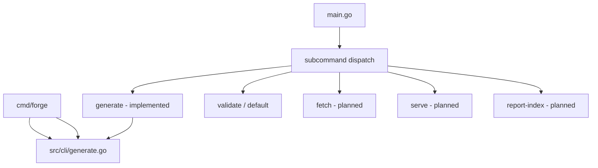

# Plan: CLI Structure — Subcommands

## Goal

Replace the growing flat-flag interface in [`main.go`](../main.go) with **discoverable subcommands** as fetch, generate, serve, and reporting features accumulate.

## Current Foundation

| Flag / behavior | Today |
|-----------------|-------|
| (none) | Validate config; print hello message |
| `-fetch=entities` | Fetch IGDB entities to `data/` |
| `-fetch-limit`, `-fetch-concurrent` | Page size and parallel pages per entity |
| `-partial` | Continue on failures; write `.partial.json`; exit `1` if any entity failed |
| `-fetch-profile` | `full`, `minimal` (default), or `checksum` |
| `-incremental` | Checksum scan + selective re-pull of changed rows |
| `-verbose` | Enable logging |
| `generate title` / `generate character` | Forge names (no IGDB credentials) — via [`src/cli/generate.go`](../src/cli/generate.go) |
| `cmd/forge` | Standalone binary for forge-only dev loop (same logic as `generate`) |

Planned additions:

- `serve` subcommand ([HTTP-API.md](./HTTP-API.md))
- `-report-index` ([CI-INFRA.md](./CI-INFRA.md))
- `fetch --resume` ([FETCH-RESUME.md](./FETCH-RESUME.md))
- `index` ([EMBEDDED-INDEX.md](./EMBEDDED-INDEX.md))
- Full subcommand dispatch (migrate `-fetch` → `fetch`)

Flat flags become unwieldy and hard to document.

## Proposed Architecture



## Target UX

```bash
# Default: validate config (unchanged behavior)
vargames-name-gen
vargames-name-gen validate

# Fetch
vargames-name-gen fetch games,genres,platforms
vargames-name-gen fetch games --profile=minimal --concurrent=4 --partial --incremental

# Generate (implemented — title + character)

# Via main binary (skips IGDB config load)
vargames-name-gen generate title -seed=42 -count=5
vargames-name-gen generate character -seed=42 -count=3

# Via forge binary (no IGDB credentials ever)
go run ./cmd/forge title -seed=42 -count=5
go run ./cmd/forge character -seed=42 -count=3
forge title -data-dir=data -strategy=concat

# Serve HTTP API (after HTTP-API)
vargames-name-gen serve --addr=:8080 --data-dir=data

# Reports
vargames-name-gen report-index --data-dir=data

# Future
vargames-name-gen index --data-dir=data    # build SQLite corpus
vargames-name-gen fetch games --resume

# Validate corpus (planned)
vargames-name-gen validate corpus --data-dir=data

# List reference IDs from corpus (planned)
vargames-name-gen list genres --data-dir=data
vargames-name-gen list platforms
```

## Implementation Approach

### Phase 1: stdlib dispatch (recommended v1)

- Parse `os.Args[1]` as subcommand name
- Each subcommand gets its own `flag.FlagSet`
- Shared flags: `-verbose`, `-data-dir` via helper or parent config struct
- **No new dependency**

### Phase 2: cobra (if subcommands exceed ~6)

- Migrate when `validate`, `fetch`, `generate`, `serve`, `report-index`, `index`, `resume` all exist
- Better help text and shell completion
- Document migration in README

## Package Layout Options

**Option A (minimal):** Keep all logic in `main.go` + `cli.go` at repo root

**Option B (in progress):** `src/cli/` with one file per subcommand — **`generate.go` and `flags.go` implemented**.

```
src/cli/
  flags.go          # DefaultDataDir, VARGAMES_DATA_DIR
  generate.go       # RunGenerate, RunForge, GenerateTitles
  generate_test.go
  fetch.go          # planned
  serve.go          # planned
  validate.go       # planned — config + corpus checks
  list.go           # planned — genres/platforms from corpus
```

## Exit Codes

| Code | Subcommand | Meaning |
|------|------------|---------|
| 0 | all | Success |
| 1 | fetch | One or more entities failed (including `-partial` partial save) |
| 1 | generate | Generation/quality exhausted |
| 2 | all | Config error (missing credentials, bad flags) |
| 2 | validate | Corpus validation failed |

Document in root README when `fetch` subcommand lands.

`cmd/forge/main.go` calls `cli.RunForge` for a credentials-free dev binary.

`main.go` delegates `generate` to `cli.RunGenerate` before `config.Load()`.

## Shared Configuration

| Flag | Env | Used by |
|------|-----|---------|
| `-verbose` | `IGDB_VERBOSE`, `VARGAMES_VERBOSE` | all |
| `-data-dir` | `VARGAMES_DATA_DIR` | generate, serve, report-index, index |

IGDB credentials only required for `fetch` subcommand.

## Backward Compatibility

| Old | New | Transition |
|-----|-----|------------|
| `-fetch=games` | `fetch games` | Accept old flag with deprecation warning for 1 release |
| `-verbose` | global `-verbose` on any subcommand | Keep working |

Print warning: `"-fetch is deprecated; use: vargames-name-gen fetch games"`.

## Help Text

```
vargames-name-gen - IGDB corpus tools and name generation

Usage:
  vargames-name-gen [command]

Commands:
  validate      Check configuration and exit
  validate corpus  Check data-dir integrity (planned)
  fetch         Fetch IGDB entities to data/
  generate      Generate game or character names
  list          List genres/platforms from corpus (planned)
  serve         Start HTTP API server
  report-index  Build HTML index of fetch reports

Flags:
  -verbose      Enable verbose logging
```

## Milestones

| Milestone | Deliverable | Effort | Status |
|-----------|-------------|--------|--------|
| C1 | Dispatch skeleton + `validate` default | ~0.5 day | partial (`generate` only) |
| C2 | `fetch` subcommand (migrate from `-fetch`) | ~0.5 day | Pending |
| C3 | Deprecation shim for `-fetch=` | ~0.25 day | Pending |
| C4 | `generate` subcommand + `cmd/forge` | ~0.25 day | **Done** |
| C5 | `serve` subcommand | ~0.25 day | Pending (HTTP-API H4) |
| C6 | `report-index` subcommand | ~0.25 day | Pending |
| C7 | `src/cli/` package extraction (fetch) | ~0.5 day | partial |
| C8 | `validate corpus` + `list genres/platforms` | ~0.5 day | Pending |

**Total estimate:** ~2–2.5 days across multiple feature landings.

## Open Decisions

1. **Binary name** — keep `vargames-name-gen` or shorten to `vng` via symlink?
2. **cobra now vs later** — stdlib first per YAGNI?
3. **Exit codes** — document per subcommand (fetch partial = 1, etc.)?

**Recommendation:** stdlib dispatch; document exit codes in README.

## Risk Register

| Risk | Mitigation |
|------|------------|
| Breaking existing scripts using `-fetch` | Deprecation period + README migration |
| Duplicated flag parsing | `src/cli/flags.go` shared helper |
| `main_test.go` breakage | Update tests when moving fetch logic |

## Related Plans

- [FORGE-PACKAGE.md](./FORGE-PACKAGE.md) — `generate` subcommand (M6)
- [HTTP-API.md](./HTTP-API.md) — `serve` subcommand (H4)
- [FETCH-ROBUSTNESS.md](./FETCH-ROBUSTNESS.md) — fetch flags move under `fetch`
- [FETCH-RESUME.md](./FETCH-RESUME.md) — `fetch --resume`
- [EMBEDDED-INDEX.md](./EMBEDDED-INDEX.md) — `index` subcommand
- [CORPUS-LIFECYCLE.md](./CORPUS-LIFECYCLE.md) — validate/list commands
- [EXPORT-FORMATS.md](./EXPORT-FORMATS.md) — `-output` on generate
