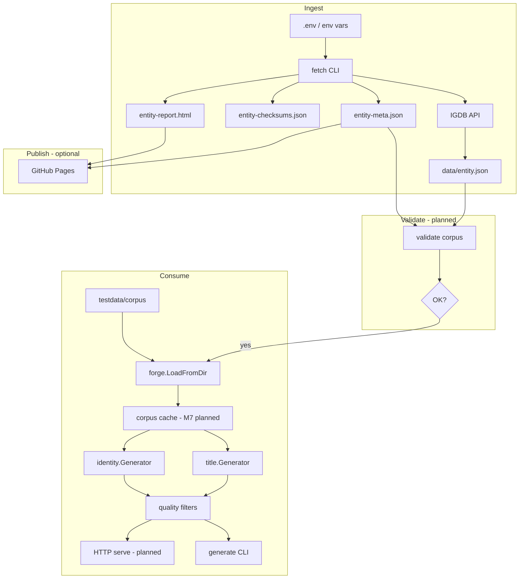

# Plan: Corpus Lifecycle — Fetch to Generation

## Goal

Document the **end-to-end data flow** from IGDB fetch through corpus validation, loading, generation, and optional HTTP serving — so developers understand how artifacts relate and where each plan fits.

## Current Foundation

| Stage | Implementation | Output |
|-------|----------------|--------|
| Configure | `config.Load()` | Twitch/IGDB credentials, limits |
| Fetch | `main.go` + `igdb.Fetcher` | `data/<entity>.json` |
| Metadata | `fetchmeta.go` | `*-meta.json`, `*-checksums.json` |
| Reports | `report.go` | `*-report.html` |
| Load | `forge.LoadFromDir` | `*forge.Corpus` in memory |
| Generate | `forge/title`, `forge/identity` | Game/character names |
| CLI | `generate` subcommand, `cmd/forge` | stdout |
| Serve | — | Not implemented |

Offline development uses committed [`testdata/corpus/`](../testdata/corpus/) instead of `data/`.

## Lifecycle Diagram



## Stage Details

### 1. Fetch

**Entry:** `go run . -fetch=games,genres,platforms` (flat flags today; `fetch` subcommand planned)

**Key flags:** `-fetch-profile=minimal`, `-incremental`, `-partial`, `-fetch-concurrent`

**Writes per entity:**
- `data/<entity>.json` — corpus source of truth
- `data/<entity>-meta.json` — counts, profile, duration, incremental stats
- `data/<entity>-checksums.json` — after `-incremental`
- `data/<entity>-report.html` — request metrics
- `data/<entity>.partial.json` — on partial failure

See [FETCH-ROBUSTNESS.md](./FETCH-ROBUSTNESS.md), [FETCH-PROFILES.md](./FETCH-PROFILES.md).

**Recommended multi-entity order:** `genres,platforms` first (ID maps), then `games,characters`, then `alternative_names,collections,companies`.

### 2. Incremental refresh

**Entry:** `go run . -fetch=games -incremental`

Checksum scan → diff → selective `where id = (...)` pulls → merge. No full re-download unless change threshold exceeded (D2 pending).

Distinct from [FETCH-RESUME.md](./FETCH-RESUME.md) (intra-run checkpoint) and `-partial` (multi-entity tolerance).

### 3. Validate (planned)

**Entry:** `vargames-name-gen validate corpus --data-dir=data`

Checks:
- Required `games.json` present and parseable
- Record counts vs `*-meta.json` when meta exists
- No `*.partial.json` mistaken for complete corpus
- Optional entities present for requested generator type

See [CLI-STRUCTURE.md](./CLI-STRUCTURE.md).

### 4. Load

**Entry:** `forge.LoadFromDir(dir)` — called by CLI and (future) HTTP server startup.

- Requires `games.json` for title generation
- Optional files skipped if missing
- Skips `*.partial.json` (document in loader)
- Performance: see [research/CORPUS-LOADING.md](../research/CORPUS-LOADING.md)
- Future: mtime-aware cache (FORGE M7), SQLite preference ([EMBEDDED-INDEX.md](./EMBEDDED-INDEX.md))

### 5. Generate

**Entry:**
```bash
go run . generate title -seed=42 -count=5
go run ./cmd/forge character -genre=12 -count=3
```

Pipeline: strategy (`pick`/`concat`) → `RejectTitle` (Q0 quality) → output.

See [FORGE-PACKAGE.md](./FORGE-PACKAGE.md), [NAME-QUALITY.md](./NAME-QUALITY.md).

### 6. Serve (planned)

**Entry:** `vargames-name-gen serve --data-dir=data --addr=:8080`

Load corpus once at startup; stateless handlers. No IGDB credentials at runtime.

See [HTTP-API.md](./HTTP-API.md).

## File Inventory

| Path | Gitignored | Purpose |
|------|------------|---------|
| `data/<entity>.json` | yes | Full entity corpus |
| `data/<entity>-meta.json` | yes | Fetch run metadata |
| `data/<entity>-checksums.json` | yes | Incremental sync state |
| `data/<entity>-report.html` | yes | Human-readable fetch metrics |
| `data/<entity>.partial.json` | yes | Incomplete fetch; not for generation |
| `data/<entity>.checkpoint.json` | yes | Resume state (planned) |
| `data/corpus.db` | yes | Optional SQLite index |
| `testdata/corpus/*.json` | no | Committed dev/CI fixtures |

## Idempotency

| Operation | Idempotent when |
|-----------|-----------------|
| Full fetch (same profile) | IGDB data stable; overwrites JSON |
| Incremental fetch | Prior corpus + checksums present |
| `LoadFromDir` | Read-only; same dir → same corpus |
| `generate` with same seed | Deterministic strategies |

## Partial + incremental interaction

| Scenario | Behavior (documented contract) |
|----------|-------------------------------|
| `.partial.json` exists, `-incremental` | Warn; require `--fresh` or complete partial fetch first |
| Checkpoint exists, `-incremental` | Separate concerns; incremental ignores checkpoint |
| `forge` load with only `.partial.json` | Skip partial files; fail if no complete `<entity>.json` |

## Milestones

| Milestone | Deliverable | Status |
|-----------|-------------|--------|
| L1 | This lifecycle doc | **Done** |
| L2 | `validate corpus` subcommand | Pending (CLI-STRUCTURE C8) |
| L3 | Partial/incremental interaction rules in code | Pending |
| L4 | `list genres/platforms` from loaded corpus | Pending (CLI-STRUCTURE C8) |

## Related Plans

- [FETCH-ROBUSTNESS.md](./FETCH-ROBUSTNESS.md) — fetch pipeline
- [FORGE-PACKAGE.md](./FORGE-PACKAGE.md) — load and generate
- [SAMPLE-CORPUS.md](./SAMPLE-CORPUS.md) — offline fixtures
- [HTTP-API.md](./HTTP-API.md) — serve stage
- [CI-INFRA.md](./CI-INFRA.md) — Pages for reports
- [research/CORPUS-LOADING.md](../research/CORPUS-LOADING.md) — load performance
- [research/DATABASE.md](../research/DATABASE.md) — storage evolution
