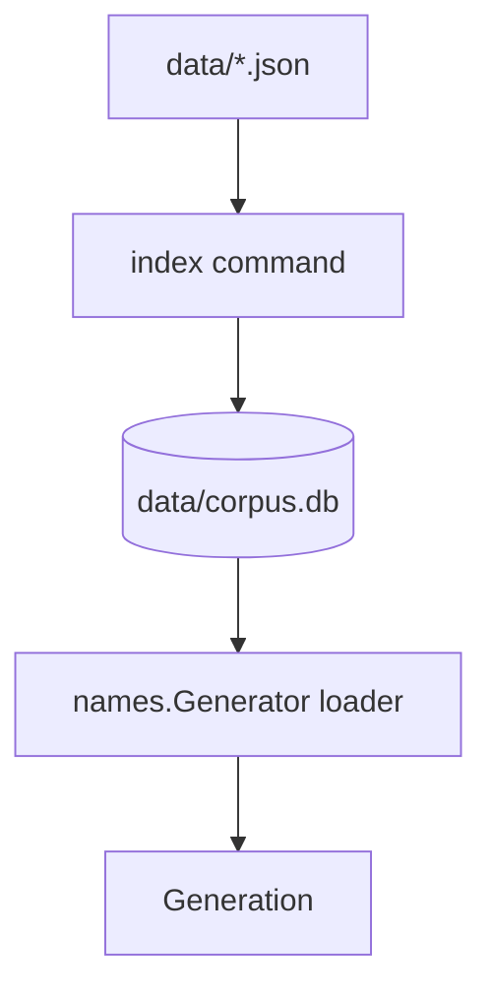

# Plan: Embedded Index — SQLite Corpus Store

## Goal

Provide an **optional SQLite backing store** for the IGDB corpus when in-memory JSON maps and ad-hoc joins (e.g. character→genre via games) become slow or cumbersome at scale.

## Current Foundation

- Corpus lives as JSON arrays in `data/<entity>.json`
- [NAMES-PACKAGE.md](./NAMES-PACKAGE.md) plans in-memory indexes built at `LoadFromDir` time
- Character genre weighting (Phase 3) requires joining `characters.games[]` → `games.genres[]`
- No database dependency in [`go.mod`](../go.mod) today (stdlib only)

## Trigger Criteria (When to Build)

Defer until profiling shows need:

- `LoadFromDir` exceeds acceptable startup time (e.g. > 5s on dev machine)
- Memory footprint of full `games.json` is problematic for deployment target
- Join queries for weighting are measurably hot in profiles

Until then, JSON + in-memory maps are sufficient.

## Proposed Architecture



## Schema (Normalized v1)

```sql
-- games
CREATE TABLE games (
  id INTEGER PRIMARY KEY,
  name TEXT NOT NULL,
  checksum TEXT
);

CREATE TABLE game_genres (
  game_id INTEGER REFERENCES games(id),
  genre_id INTEGER,
  PRIMARY KEY (game_id, genre_id)
);

CREATE TABLE game_platforms (
  game_id INTEGER REFERENCES games(id),
  platform_id INTEGER,
  PRIMARY KEY (game_id, platform_id)
);

-- characters
CREATE TABLE characters (
  id INTEGER PRIMARY KEY,
  name TEXT NOT NULL,
  checksum TEXT
);

CREATE TABLE character_games (
  character_id INTEGER REFERENCES characters(id),
  game_id INTEGER,
  PRIMARY KEY (character_id, game_id)
);

-- reference tables
CREATE TABLE genres (id INTEGER PRIMARY KEY, name TEXT);
CREATE TABLE platforms (id INTEGER PRIMARY KEY, name TEXT);

-- alternative_names
CREATE TABLE alternative_names (
  id INTEGER PRIMARY KEY,
  name TEXT NOT NULL,
  game_id INTEGER,
  comment TEXT  -- region/locale hint
);

-- metadata
CREATE TABLE corpus_meta (
  key TEXT PRIMARY KEY,
  value TEXT
);
```

Indexes on `game_genres(genre_id)`, `character_games(game_id)`, `alternative_names(game_id)`.

## Package Layout

```
src/store/
  sqlite.go         # Open, schema migrate
  import.go         # JSON files → tables
  query.go          # Genre-filtered name pools, joins
  store_test.go
```

## Loader Integration

```go
func LoadFromDir(dir string) (*Generator, error) {
    dbPath := filepath.Join(dir, "corpus.db")
    if _, err := os.Stat(dbPath); err == nil {
        return loadFromSQLite(dbPath)
    }
    return loadFromJSON(dir)
}
```

SQLite preferred when present; JSON fallback for simplicity.

## CLI

```bash
# Build or rebuild DB from JSON
vargames-name-gen index --data-dir=data

# Force rebuild
vargames-name-gen index --data-dir=data --fresh
```

See [CLI-STRUCTURE.md](./CLI-STRUCTURE.md).

## Dependency

- `modernc.org/sqlite` (pure Go, no CGO) **or** `github.com/mattn/go-sqlite3` (CGO)
- **Recommendation:** `modernc.org/sqlite` for cross-compilation and CI simplicity

## Milestones

| Milestone | Deliverable | Effort |
|-----------|-------------|--------|
| E1 | Schema + migrate on open | ~0.5 day |
| E2 | `import` from JSON (games, genres, characters) | ~1 day |
| E3 | `index` CLI command | ~0.25 day |
| E4 | `names` loader adapter + genre pool query | ~1 day |
| E5 | Benchmark JSON vs SQLite load + query | ~0.5 day |
| E6 | Import remaining entities (alt names, etc.) | ~0.5 day |

**Total estimate:** ~3–4 days.

**Depends on:** [NAMES-PACKAGE.md](./NAMES-PACKAGE.md) M3+; defer until profiling justifies.

## Open Decisions

1. **DB location** — `data/corpus.db` vs `data/sqlite/corpus.db`?
2. **Single file vs per-entity** — one DB for all entities (recommended)
3. **Ship DB in repo** — no; build from JSON or sample corpus locally
4. **WAL mode** — enable for concurrent read during serve?

**Recommendation:** Single `corpus.db`; WAL for HTTP server reads during optional re-index.

## Risk Register

| Risk | Mitigation |
|------|------------|
| Premature optimization | Strict trigger criteria; benchmark before merging |
| Schema migration pain | `corpus_meta.schema_version`; rebuild from JSON is escape hatch |
| CGO in CI | Use modernc.org/sqlite |
| Drift between JSON and DB | `index` rebuild from JSON is source of truth |

## Related Plans

- [NAMES-PACKAGE.md](./NAMES-PACKAGE.md) — primary consumer; M3 join complexity motivator
- [CLI-STRUCTURE.md](./CLI-STRUCTURE.md) — `index` subcommand
- [FETCH-PROFILES.md](./FETCH-PROFILES.md) — lean JSON makes import fast
- [LOCALIZATION.md](./LOCALIZATION.md) — `alternative_names.comment` column
- [HTTP-API.md](./HTTP-API.md) — faster startup if DB pre-built
