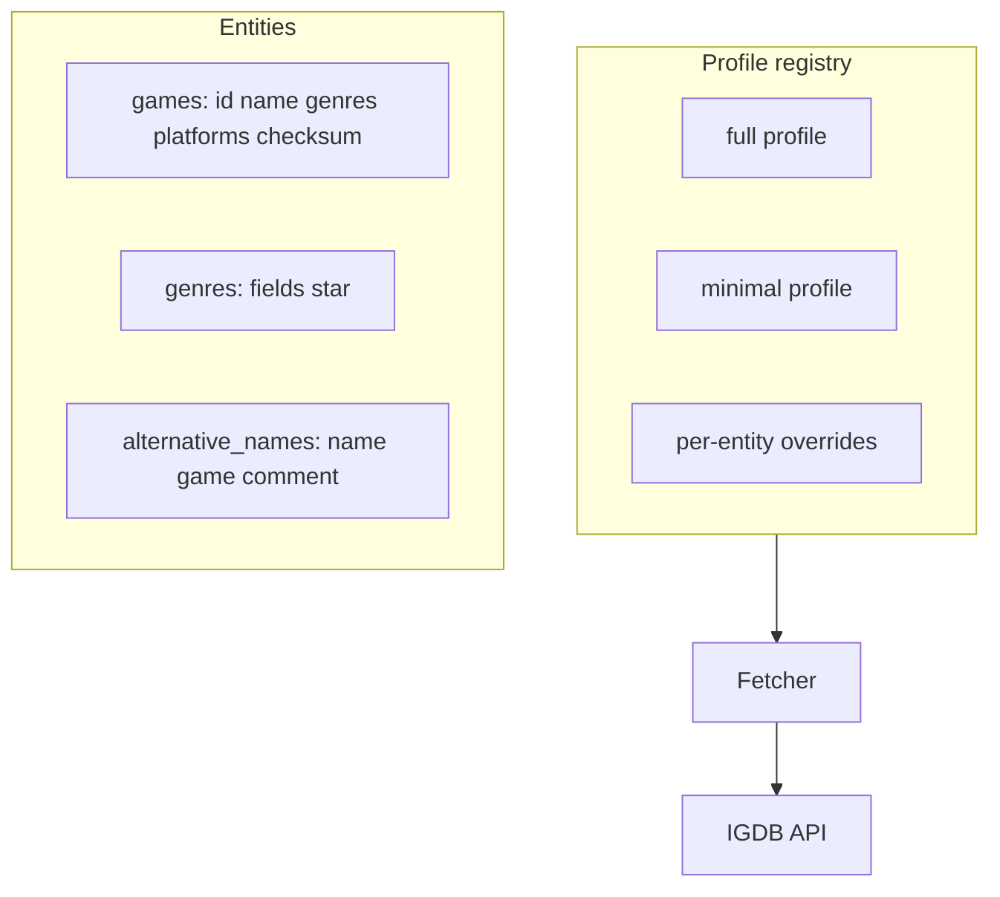

# Plan: Per-Entity Fetch Profiles

## Goal

Replace the universal `fields *;` Apicalypse prefix with **per-entity fetch profiles** that select only the fields each downstream consumer needs — smaller payloads, faster loads, and cheaper checksum/incremental scans.

## Current Foundation

- [`QueryPrefixForEntity`](../src/igdb/entities.go) returns `DefaultQueryPrefix` (`fields *;`) for every entity
- [`Fetcher`](../src/igdb/fetcher.go) appends `limit` / `offset` after the query prefix
- [`bruno/games.yml`](../bruno/games.yml) requests rich nested fields; fetcher does not match this today
- [`FORGE-PACKAGE.md`](./FORGE-PACKAGE.md) only needs `id`, `name`, `genres`, `platforms`, `checksum` for games
- [`FETCH-ROBUSTNESS.md`](./FETCH-ROBUSTNESS.md) Phase D benefits from lightweight `id,checksum` profiles

## Proposed Architecture



## Profile Definitions

### Named profiles

| Profile | Purpose | Typical use |
|---------|---------|-------------|
| `full` | `fields *;` | Archival, exploration, unknown consumers |
| `minimal` | Entity-specific lean field sets | Name generation, checksum scans |
| `checksum` | `fields id,checksum;` only | Incremental sync (FETCH-ROBUSTNESS D) |

### Per-entity minimal field sets (v1)

| Entity | Minimal query prefix |
|--------|---------------------|
| `games` | `fields id,name,genres,platforms,checksum;` |
| `characters` | `fields id,name,games,checksum;` |
| `genres` | `fields id,name,slug,checksum;` |
| `platforms` | `fields id,name,abbreviation,checksum;` |
| `collections` | `fields id,name,checksum;` |
| `companies` | `fields id,name,checksum;` |
| `alternative_names` | `fields id,name,game,comment,checksum;` |

### Package layout

```
src/igdb/
  profiles.go       # Profile type, registry, ProfileFor(entity, name)
  profiles_test.go
```

```go
type Profile struct {
    Name         string
    QueryPrefix  string   // semicolon-terminated Apicalypse fragment
}

func ProfileFor(entity Entity, name string) (Profile, error)
func DefaultProfile() Profile  // minimal for name-gen path
```

## Configuration

### Env / CLI

| Name | Default | Description |
|------|---------|-------------|
| `IGDB_FETCH_PROFILE` | `minimal` | Global profile: `full`, `minimal`, `checksum` |
| `-fetch-profile` | from env | CLI override |
| `-fetch-profile-games=full` | — | Per-entity override (optional v1.1) |

Wire into [`main.go`](../main.go) → `FetcherOptions.QueryPrefix` via `ProfileFor`.

## Milestones

| Milestone | Deliverable | Effort |
|-----------|-------------|--------|
| P1 | `Profile` type + registry with `full` and `minimal` | ~0.5 day |
| P2 | Minimal prefixes for all 7 entities | ~0.5 day |
| P3 | `checksum` profile for incremental sync | ~0.25 day |
| P4 | CLI/env `-fetch-profile` wired in `main` | ~0.25 day |
| P5 | Per-entity override flags (optional) | ~0.5 day |
| P6 | Document profile → file size impact in README | ~0.25 day |

**Total estimate:** ~2–2.5 days.

## Open Decisions

1. **Default profile** — switch default from `full` to `minimal` (breaking for anyone relying on extra fields in JSON)?
2. **Games nested fields** — include `release_dates` like Bruno, or stay lean for names?
3. **Profile in meta JSON** — record which profile was used in `*-meta.json` (FETCH-ROBUSTNESS C)?

**Recommendation:** Default `minimal` for new fetches; document migration; record profile in meta JSON.

## Risk Register

| Risk | Mitigation |
|------|------------|
| Missing field breaks future feature | `full` profile always available; meta records profile used |
| IGDB field deprecation | Profiles centralized in one file; easy to update |
| `names` loader expects fields absent in old JSON | Loader treats optional fields gracefully |

## Related Plans

- [FETCH-ROBUSTNESS.md](./FETCH-ROBUSTNESS.md) — checksum profile powers Phase D
- [FORGE-PACKAGE.md](./FORGE-PACKAGE.md) — defines which fields are required
- [LOCALIZATION.md](./LOCALIZATION.md) — `alternative_names` needs `comment` field in profile
- [SAMPLE-CORPUS.md](./SAMPLE-CORPUS.md) — fixtures should match minimal profile shape
