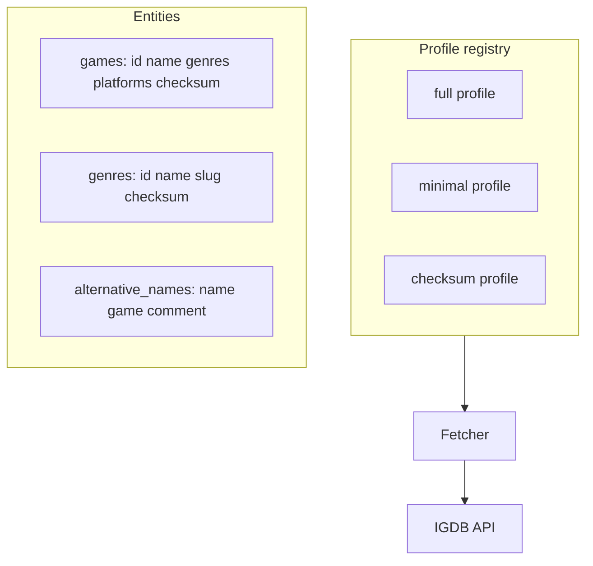

# Plan: Per-Entity Fetch Profiles

## Goal

Replace the universal `fields *;` Apicalypse prefix with **per-entity fetch profiles** that select only the fields each downstream consumer needs — smaller payloads, faster loads, and cheaper checksum/incremental scans.

## Current Foundation

- [`profiles.go`](../src/igdb/profiles.go) — `Profile`, `ProfileFor`, `full` / `minimal` / `checksum` registry
- [`QueryPrefixForEntity`](../src/igdb/entities.go) delegates to the default **minimal** profile
- [`main.go`](../main.go) wires `-fetch-profile` / `IGDB_FETCH_PROFILE` into `FetcherOptions.QueryPrefix`
- [`fetchmeta.go`](../fetchmeta.go) records `fetch_profile` in `*-meta.json`
- [`FORGE-PACKAGE.md`](./FORGE-PACKAGE.md) consumes minimal field sets from fetched JSON

## Proposed Architecture



## Profile Definitions

### Named profiles

| Profile | Purpose | Typical use |
|---------|---------|-------------|
| `full` | `fields *;` | Archival, exploration, unknown consumers |
| `minimal` | Entity-specific lean field sets | Name generation, default fetch (**default**) |
| `checksum` | `fields id,checksum;` only | Incremental sync scan (used internally by `-incremental`) |

### Per-entity minimal field sets (v1)

| Entity | Minimal query prefix |
|--------|---------------------|
| `games` | `fields id,name,genres,platforms,checksum;` |
| `characters` | `fields id,name,games,checksum;` |
| `genres` | `fields id,name,slug,checksum;` |
| `platforms` | `fields id,name,abbreviation,checksum;` |
| `collections` | `fields id,name,checksum;` |
| `companies` | `fields id,name,checksum;` |
| `alternative_names` | `fields id,name,game,comment,checksum;` |

### Package layout

```
src/igdb/
  profiles.go       # Profile type, registry, ProfileFor(entity, name)
  profiles_test.go
  incremental.go    # checksum scan + selective ID pulls (uses minimal for full rows)
```

## Configuration

### Env / CLI

| Name | Default | Description |
|------|---------|-------------|
| `IGDB_FETCH_PROFILE` | `minimal` | Global profile: `full`, `minimal`, `checksum` |
| `-fetch-profile` | from env | CLI override |

Wire into [`main.go`](../main.go) → `FetcherOptions.QueryPrefix` via `ProfileFor`.

## Milestones

| Milestone | Deliverable | Status |
|-----------|-------------|--------|
| P1 | `Profile` type + registry with `full` and `minimal` | **Done** |
| P2 | Minimal prefixes for all 7 entities | **Done** |
| P3 | `checksum` profile for incremental sync | **Done** |
| P4 | CLI/env `-fetch-profile` wired in `main` | **Done** |
| P5 | Per-entity override flags (optional) | Pending |
| P6 | Document profile → file size impact in README | **Done** (see root README) |

## Open Decisions

1. ~~**Default profile** — switch default from `full` to `minimal`?~~ **Resolved:** default is `minimal`.
2. **Games nested fields** — include `release_dates` like Bruno, or stay lean for names? **Stay lean** unless a consumer needs them.
3. ~~**Profile in meta JSON**~~ **Done** — `fetch_profile` in `*-meta.json`.

## Risk Register

| Risk | Mitigation |
|------|------------|
| Missing field breaks future feature | `full` profile always available; meta records profile used |
| IGDB field deprecation | Profiles centralized in `profiles.go`; easy to update |
| Old `fields *` JSON on disk | Re-fetch with `-fetch-profile=minimal` to shrink corpus |

## Related Plans

- [FETCH-ROBUSTNESS.md](./FETCH-ROBUSTNESS.md) — `-incremental` uses checksum scan + minimal full pulls
- [FORGE-PACKAGE.md](./FORGE-PACKAGE.md) — defines which fields are required
- [LOCALIZATION.md](./LOCALIZATION.md) — `alternative_names.comment` included in minimal profile
