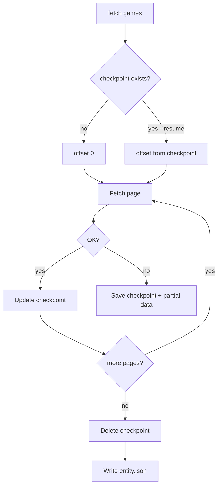

# Plan: Fetch Resume & Checkpoints

## Goal

Allow interrupted entity fetches to **resume from the last successful page** without re-downloading earlier offsets — distinct from `-partial` (which continues other entities on failure).

## Current Foundation

- [`Fetcher.FetchAll`](../src/igdb/fetcher.go) always starts at offset 0
- On failure, all progress is lost unless `-partial` writes `*.partial.json` ([FETCH-ROBUSTNESS.md](./FETCH-ROBUSTNESS.md) Phase B)
- No checkpoint state on disk
- Long-running fetches (e.g. `games`) are vulnerable to network blips, laptop sleep, rate limits

## Distinction: Resume vs Partial

| Feature | Scope | On failure |
|---------|-------|------------|
| `-partial` | Multi-entity run | Other entities continue; failed entity may save partial JSON |
| `--resume` | Single entity | Next run continues from last committed offset |

They complement each other.

## Proposed Architecture



## Checkpoint File Format

Path: `data/<entity>.checkpoint.json` (gitignored with `data/`)

```json
{
  "entity": "games",
  "profile": "minimal",
  "limit": 500,
  "next_offset": 6000,
  "pages_completed": 12,
  "items_fetched": 6000,
  "started_at": "2026-07-07T10:00:00Z",
  "updated_at": "2026-07-07T10:45:00Z",
  "partial_path": "data/games.partial.json"
}
```

### Rules

- **Create** checkpoint after first successful page
- **Update** after each successful page (atomic write: temp file + rename)
- **Delete** on successful completion of full entity
- **Invalidate** if `limit` or fetch profile differs from checkpoint (warn + require `--fresh`)

## Partial Data Accumulation

While resuming, append pages to `data/<entity>.partial.json` (JSON array grows) OR merge in memory and rewrite periodically.

**Recommendation:** Append to in-memory slice; flush `partial.json` every N pages (e.g. 10) for crash safety; final write to `<entity>.json` on completion.

## CLI

```bash
# Resume if checkpoint exists (default behavior when checkpoint found)
vargames-name-gen fetch games --resume

# Ignore checkpoint; start fresh
vargames-name-gen fetch games --fresh

# Explicit no-resume
vargames-name-gen fetch games --no-resume
```

Integrate with [CLI-STRUCTURE.md](./CLI-STRUCTURE.md) `fetch` subcommand.

## Concurrent Fetch Interaction

When [FETCH-ROBUSTNESS.md](./FETCH-ROBUSTNESS.md) Phase A lands:

- Checkpoint tracks **completed offsets** (set of ranges), not just sequential `next_offset`
- On resume, skip offsets already in checkpoint set
- More complex; implement sequential resume first

## Milestones

| Milestone | Deliverable | Effort |
|-----------|-------------|--------|
| R1 | Checkpoint JSON type + read/write helpers | ~0.5 day |
| R2 | Sequential `FetchAll` resume loop | ~0.5 day |
| R3 | `--resume` / `--fresh` CLI flags | ~0.25 day |
| R4 | Profile/limit mismatch detection | ~0.25 day |
| R5 | Periodic partial.json flush | ~0.5 day |
| R6 | Resume with concurrent fetch (offset set) | ~1 day |

**Total estimate:** ~2–3 days (R1–R5); +1 day for R6.

**Depends on:** FETCH-ROBUSTNESS Phase A–B recommended first.

## Open Decisions

1. **Default behavior** — auto-resume when checkpoint exists, or opt-in only?
2. **Checkpoint in CI** — never; document that CI fetch uses `--fresh`
3. **Merge with incremental sync** — separate concerns; checkpoint is per-run, checksum sync is cross-run

**Recommendation:** Opt-in `--resume`; print hint when checkpoint detected and `--fresh` not passed.

## Risk Register

| Risk | Mitigation |
|------|------------|
| Corrupt checkpoint | Validate JSON; offer `--fresh` |
| IGDB data shifted underfoot (offsets unstable) | IGDB offsets are stable for static queries; document assumption |
| Duplicate items on resume bug | Track `next_offset` strictly; test golden resume |
| Huge partial.json | Flush incrementally; same as partial fetch risk |

## Related Plans

- [FETCH-ROBUSTNESS.md](./FETCH-ROBUSTNESS.md) — partial multi-entity; concurrent fetch
- [CLI-STRUCTURE.md](./CLI-STRUCTURE.md) — `fetch --resume` flag
- [FETCH-PROFILES.md](./FETCH-PROFILES.md) — profile in checkpoint for invalidation
- [OBSERVABILITY.md](./OBSERVABILITY.md) — log resume offset on start
