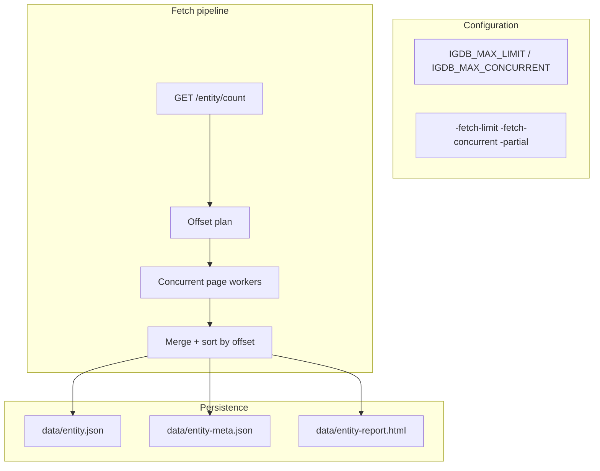

# Plan: Fetch Robustness & Configurability

## Goal

Make fetching faster, safer to re-run, and tolerant of partial failure — without breaking the current sequential baseline.

## Current Gaps

| Area | Today |
|------|-------|
| `MaxConcurrent` | Semaphore exists in `Fetcher`, but `FetchAll` is **sequential** |
| `MaxLimit` | Global via `IGDB_MAX_LIMIT` / `Config.MaxLimit` only |
| Failure mode | Any entity error → `log.Fatal` in `main` |
| Metadata | HTML reports only; nothing machine-readable for diffs |
| Change detection | Not implemented (`/count`, `checksum` noted in README TODO) |

## Proposed Architecture



## Phase A — Configurability (Low Risk, Do First)

### Config Additions

```go
// config.Config
MaxConcurrent int  // default 4, env IGDB_MAX_CONCURRENT
```

### CLI Flags

```
-fetch-limit=500          # override per run (default from config)
-fetch-concurrent=4       # parallel pages within one entity
-partial                   # continue other entities/pages on error
```

Wire `main.go` to pass these into `FetcherOptions` instead of hardcoded `MaxConcurrent: 4`.

### `Fetcher.FetchAll` → Concurrent Pages

1. Call `GET /<entity>/count` (new `Client.Count(ctx, entity)` → `int`)
2. Compute pages: `ceil(count / limit)`
3. Spawn workers bounded by `sem` (already in struct)
4. Each worker: fetch one offset, return `(offset, []json.RawMessage, err)`
5. Merge results **sorted by offset** (preserve order for reproducibility)
6. Validate: merged count == count (warn if mismatch)

**Fallback:** If count endpoint fails, fall back to current sequential scan (log warning).

Bruno collections already exist under `bruno/counts/` for all supported entities.

### Tests

- Mock client returning count + ordered pages
- Concurrent fetch produces same result as sequential fixture
- Context cancel stops in-flight workers

## Phase B — Partial Results & Run Summary

### Per-Entity Result Type

```go
type FetchResult struct {
    Entity      string
    Items       []json.RawMessage
    Err         error           // partial failure detail
    PagesOK     int
    PagesFailed int
    Duration    time.Duration
}
```

### `main.go` Behavior with `-partial`

- Don't `Fatal` on first entity error
- Write successful entities normally
- For failed entities: write `data/<entity>.partial.json` if any pages succeeded
- Exit code `1` if any failures, `0` if all OK
- Log summary: `"games: OK 350000 items | characters: FAILED page 12/400"`

## Phase C — Fetch Metadata Persistence

### `data/<entity>-meta.json`

```json
{
  "entity": "games",
  "fetched_at": "2026-07-07T18:50:00Z",
  "count_reported": 350123,
  "count_fetched": 350123,
  "limit": 500,
  "max_concurrent": 4,
  "duration_ms": 123456,
  "checksum_sample": null
}
```

Enables:

- Basic change detection (count changed since last run)
- Machine-readable CI/report aggregation
- Future incremental sync

## Phase D — Checksum-Based Incremental Fetch (R&D → Implement)

Documented in README as two competing approaches:

### Approach 1: Full Lightweight Scan + Selective Full Pull

1. Fetch `fields id,checksum;` with paging (small payloads)
2. Compare to `data/<entity>-checksums.json` from last run
3. Collect IDs where checksum differs or is new
4. Batch-fetch full records: `where id = (1,2,3,...);` (IGDB supports `where id = (...)` with limits)
5. Merge into existing `data/<entity>.json` on disk

### Approach 2: Full Re-Pull When Count Changes

- Simpler: if `count` != `meta.count_reported`, run full `FetchAll`
- Good enough until corpus stabilizes

### Recommendation

- **Ship Phase C with count-only detection first**
- **Prototype Approach 1** on `genres` (small entity) to measure request count vs full re-pull
- Add `-incremental` flag only after prototype proves win

## Phase E — Reporting Enhancements

- Add `data/<entity>-summary.json` alongside HTML (retry distribution, status codes)
- Include count mismatch and partial-failure sections in HTML report
- Optional: master `data/index.html` linking all reports (see `CI-INFRA.md` for GitHub Pages hosting)

## Milestones

| Milestone | Deliverable | Depends on |
|-----------|-------------|------------|
| A1 | `IGDB_MAX_CONCURRENT` + CLI flags | — |
| A2 | `Client.Count()` | — |
| A3 | Concurrent `FetchAll` with merge | A2 |
| B1 | `-partial` + exit codes + partial files | A3 |
| C1 | `-meta.json` written each run | B1 |
| D1 | Checksum prototype on `genres` | C1 |
| D2 | `-incremental` for all entities | D1 metrics |
| E1 | JSON summary + improved HTML | C1 |

**Total estimate:** ~5–8 days (A–C production-ready in ~3–4 days; D is R&D-heavy).

## Risk Register

| Risk | Mitigation |
|------|------------|
| IGDB rate limits under concurrency | Default `MaxConcurrent=4`; respect existing backoff in `Client.Post` |
| Out-of-order page merge bugs | Sort by offset; test against golden sequential output |
| Count endpoint drift vs actual pages | Log mismatch; fall back to sequential |
| Checksum approach more requests than full pull | Benchmark on small entity before committing |
| Partial JSON files confuse `names` loader | `names` loads only `*.json` excluding `*.partial.json`; document clearly |

## Suggested Execution Order (Cross-Plan)

1. **Phase A** — concurrent fetch + config (faster corpus, no API change for names)
2. **NAMES-PACKAGE M1–M4** — names package on stable `data/`
3. **Phase B–C** — partial results + meta (helps iterative name tuning)
4. **NAMES-PACKAGE M5–M6** — Markov + CLI
5. **Phase D** — incremental fetch once re-fetching becomes routine

## Related Plans

- [NAMES-PACKAGE.md](./NAMES-PACKAGE.md) — consumes `data/*.json` output
- [CI-INFRA.md](./CI-INFRA.md) — CI for fetch tests; GitHub Pages for reports
