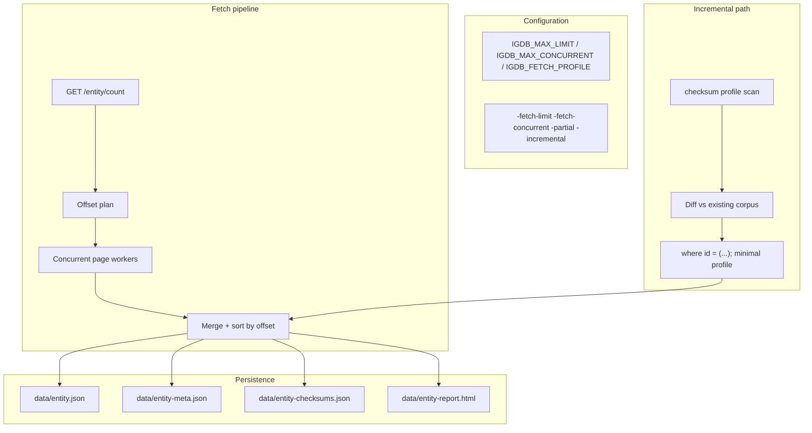

# Plan: Fetch Robustness & Configurability

## Goal

Make fetching faster, safer to re-run, and tolerant of partial failure — without breaking the current sequential baseline.

## Current Foundation

| Area | Status |
|------|--------|
| Concurrent paging via `/count` | **Done** (Phase A) |
| `IGDB_MAX_LIMIT` / `IGDB_MAX_CONCURRENT` + CLI flags | **Done** |
| `-partial` + `.partial.json` + exit codes | **Done** (Phase B) |
| `data/<entity>-meta.json` | **Done** (Phase C) |
| Fetch profiles (`minimal` default) | **Done** ([FETCH-PROFILES.md](./FETCH-PROFILES.md)) |
| `-incremental` checksum re-fetch | **Done** (Phase D v1) |
| JSON summary reports | Pending (Phase E) |

## Proposed Architecture



## Phase A — Configurability ✅

- `IGDB_MAX_CONCURRENT`, `-fetch-limit`, `-fetch-concurrent`
- `Client.Count()`, concurrent `FetchAll` with merge + sequential fallback

## Phase B — Partial Results & Run Summary ✅

- `FetchResult` with page stats
- `-partial`: continue on failure, write `.partial.json`, exit `1` if any entity failed

## Phase C — Fetch Metadata Persistence ✅

### `data/<entity>-meta.json`

```json
{
  "entity": "games",
  "fetched_at": "2026-07-07T18:50:00Z",
  "fetch_profile": "minimal",
  "incremental": true,
  "count_reported": 350123,
  "count_fetched": 350123,
  "count_previous": 350000,
  "limit": 500,
  "max_concurrent": 4,
  "duration_ms": 123456,
  "ids_updated": 12,
  "ids_new": 3,
  "ids_removed": 1,
  "ids_unchanged": 350107
}
```

## Phase D — Checksum-Based Incremental Fetch ✅ (v1)

### Implemented: Approach 1 (checksum scan + selective pull)

1. Scan with `fields id,checksum;` (paginated)
2. Compare to existing `data/<entity>.json` by id + checksum
3. Batch-fetch changed/new IDs with **minimal** profile: `where id = (...);`
4. Merge into corpus (drop IDs removed from IGDB)
5. Write `data/<entity>-checksums.json`

### CLI

```bash
# First fetch (full minimal pull)
go run . -fetch=games

# Later: only changed rows
go run . -fetch=games -incremental
```

- No existing corpus → full fetch (same as non-incremental)
- Count change logged when prior `*-meta.json` exists (`count changed X -> Y`)
- Use `-fetch-profile=full` only when you need archival `fields *;`

### Not yet implemented

- Auto fallback to full re-pull when >N% of rows changed (D2)
- Per-entity incremental metrics in HTML report

### D2 — Full re-pull threshold

When `-incremental` detects more than **5%** of IDs as changed/new/removed, auto-fallback to full fetch and log reason.

| Config | Default | Description |
|--------|---------|-------------|
| `IGDB_INCREMENTAL_MAX_CHANGE_PCT` | `5` | Max changed fraction before full re-pull |
| `-incremental-max-change` | from env | CLI override |

Override with `-incremental-force` to always use checksum path regardless of change volume.

### Entity fetch ordering

Recommended order for multi-entity pulls (reference tables first):

```
genres,platforms → games,characters → alternative_names,collections,companies
```

### Fetch dry-run (planned)

`fetch games --dry-run` — call `/count` only; estimate pages, bytes (from profile), and duration. No writes.

### Idempotency

Same profile + stable IGDB data → same `data/<entity>.json` after full fetch. Incremental merge is deterministic given prior corpus + checksums.

### Partial + incremental interaction

| Scenario | Contract |
|----------|----------|
| `.partial.json` exists, `-incremental` | Warn; require completing fetch or `--fresh` |
| `forge` loader | Skips `*.partial.json`; requires complete `<entity>.json` |

See [CORPUS-LIFECYCLE.md](./CORPUS-LIFECYCLE.md).

## Phase E — Reporting Enhancements

- Add `data/<entity>-summary.json` alongside HTML (retry distribution, status codes)
- Include count mismatch and partial-failure sections in HTML report
- Optional: master `data/index.html` linking all reports (see `CI-INFRA.md` for GitHub Pages hosting)

### `summary.json` schema (shared with OBSERVABILITY)

```json
{
  "entity": "games",
  "requests": 700,
  "total_retries": 12,
  "status_codes": { "200": 695, "429": 5 },
  "error_classes": { "rate_limit": 5 },
  "duration_ms": { "p50": 320, "p95": 890, "max": 2100 },
  "igdb_error_samples": ["rate limit exceeded"]
}
```

## Milestones

| Milestone | Deliverable | Status |
|-----------|-------------|--------|
| A1 | `IGDB_MAX_CONCURRENT` + CLI flags | **Done** |
| A2 | `Client.Count()` | **Done** |
| A3 | Concurrent `FetchAll` with merge | **Done** |
| B1 | `-partial` + exit codes + partial files | **Done** |
| C1 | `-meta.json` written each run | **Done** |
| D1 | Checksum incremental on all entities | **Done** |
| D2 | Full re-pull threshold / tuning | Pending |
| E1 | JSON summary + improved HTML | Pending |

## Risk Register

| Risk | Mitigation |
|------|------------|
| IGDB rate limits under concurrency | Default `MaxConcurrent=4`; respect existing backoff in `Client.Post` |
| Out-of-order page merge bugs | Sort by offset; test against golden sequential output |
| Count endpoint drift vs actual pages | Log mismatch; fall back to sequential |
| Checksum approach more requests than full pull | Log incremental stats; optional full re-fetch when corpus is new |
| Partial JSON files confuse `forge` loader | `forge` skips `*.partial.json`; document clearly |

## Suggested Execution Order (Cross-Plan)

1. ~~**Phase A**~~ — concurrent fetch + config
2. ~~**FORGE-PACKAGE M1–M4**~~ — forge library on stable `data/`
3. ~~**Phase B–C**~~ — partial results + meta
4. ~~**FETCH-PROFILES**~~ — minimal default profiles
5. ~~**Phase D v1**~~ — `-incremental` re-fetch
6. **FORGE-PACKAGE M5–M6** — Markov + CLI polish
7. **Phase E** — JSON summary reports

## Related Plans

- [FETCH-PROFILES.md](./FETCH-PROFILES.md) — field selection registry
- [FORGE-PACKAGE.md](./FORGE-PACKAGE.md) — consumes `data/*.json` output
- [CI-INFRA.md](./CI-INFRA.md) — CI for fetch tests; GitHub Pages for reports
- [CORPUS-LIFECYCLE.md](./CORPUS-LIFECYCLE.md) — partial/incremental interaction rules
