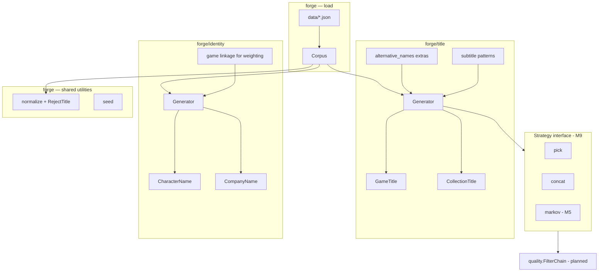

# Plan: `forge` Package — Procedural Generation from IGDB Data

## Goal

Turn fetched JSON in `data/` into a reusable library that forges **game-world text artifacts** from IGDB corpora: titles, character names, collection names, company labels, and related patterns — with optional genre weighting and reproducible output via seeds.

## Current Foundation

- **Fetch output:** `data/<entity>.json` — arrays of raw IGDB objects
- **Entities loaded:** `games`, `characters`, `alternative_names`, `collections`, `companies`, `genres`, `platforms`
- **`src/forge/`** — corpus loader (`LoadFromDir`, minimal structs)
- **`src/forge/title/`** — `GameTitle` with `pick`/`concat`, genre filtering, subtitle mutations
- **`src/forge/identity/`** — `CharacterName` with `pick`/`concat`, genre join via `characters.games[]` → `games.genres[]`
- **`main.go`** — fetch; `generate title` / `generate character` subcommands (no IGDB creds)
- **`cmd/forge`** — standalone forge CLI (dev loop, no IGDB creds)
- **`src/cli/`** — shared `GenerateTitles`, `RunGenerate`, `RunForge`

## Proposed Architecture



Shared options across subpackages: `Seed`, `GenreID`, `PlatformID` (M3b), `Locale` (LOCALIZATION).

## Strategy Interface (M9)

```go
// forge/title (identity mirrors pattern)
type Strategy interface {
    Name() string
    Generate(ctx GenerateContext) (string, error)
}
```

Built-in strategies: `pick` (reservoir), `concat` (splice/mutate). `markov` added in M5. See [GENERATION-STRATEGIES.md](./GENERATION-STRATEGIES.md) for plugin registry.

## Quality Layering

| Layer | Location | Status |
|-------|----------|--------|
| Q0 — length, charset, exact corpus match, noise | [`forge.RejectTitle`](../src/forge/normalize.go) | **Implemented** |
| Q1–Q6 — profanity, batch dedup, retry loop | `forge/quality` (planned) | Pending |

See [NAME-QUALITY.md](./NAME-QUALITY.md). Avoid duplicating Q0 rules in the quality subpackage.

## Package Layout

```
src/forge/
  doc.go
  corpus.go          # LoadFromDir, Corpus, minimal entity structs
  corpus_test.go
  testutil.go        # TestCorpusDir
  normalize.go       # shared tokenization (M2+)
  seed.go            # deterministic PRNG (M2+)

src/forge/title/
  doc.go
  generator.go       # title.Generator
  options.go         # title-specific Options (M2+)
  concat.go          # splice/mutate game titles (M2)
  extras.go          # subtitles, alt-name tokens (M2+)
  markov.go          # title Markov models (M5)

src/forge/identity/
  doc.go
  generator.go       # identity.Generator
  options.go         # identity-specific Options (M4+)
  generate.go        # character / company generation (M4)
  extras.go          # epithets, game-link weighting (M4+)
```

## Data Model (Minimal Structs)

Parse only fields needed for generation and weighting. Do not mirror full IGDB schemas.

| Entity | Package consumer | Fields |
|--------|------------------|--------|
| `games` | `title`, `identity` (linkage) | `id`, `name`, `genres[]`, `platforms[]` |
| `characters` | `identity` | `id`, `name`, `games[]` |
| `companies` | `identity` | `id`, `name` |
| `collections` | `title` | `id`, `name` |
| `alternative_names` | `title` (mutation tokens) | `name`, `game` |
| `genres` | both (weighting) | `id`, `name` |
| `platforms` | reference metadata (loaded; not used for title filtering) | `id`, `name` |

## Public API (v1)

```go
// forge — load once, share across generators
corpus, err := forge.LoadFromDir("data")

titles := title.New(corpus)
identities := identity.New(corpus)

// title.Options — genre filter, strategy, seed
name, err := titles.GameTitle(title.Options{GenreID: &rpgID, Seed: 42})

// identity.Options — game linkage, seed
char, err := identities.CharacterName(identity.Options{Seed: 42})
```

Each subpackage owns its `Options` and extras; shared concerns (`normalize`, `seed`) live in `forge`.

## Generation Strategies (Phased)

### Phase 1 — Baseline (`forge/title`, ship first)

1. **Reservoir sampling** from a genre-filtered pool (fallback to all games when no matches)
2. **Concat / mutate:**
   - Split titles on spaces, `:`, `-`
   - Combine 2 fragments from different titles
   - Light mutations: subtitle patterns (`: Reborn`, `II`, `Remastered`)
3. **Reject rules:** too short/long, duplicate of source, all-caps noise, empty after normalize

### Phase 2 — Markov (`forge/title`)

- Character bigram/trigram models per pool (all games, or per-genre)
- Filter against exact existing titles in corpus

### Phase 3 — Weighting polish

- Soft weighting: 80% matching genre, 20% global pool
- `alternative_names` as mutation tokens in `title`, not direct output

### Phase 4 — Identity (`forge/identity`) ✅ (core)

- Character names from `characters` pool — **done** (`CharacterName`)
- Genre weighting via `characters.games[]` → `games.genres[]` — **done** (`identity/filter.go`)
- Company labels from `companies` — pending (`CompanyName`, M4b)

## CLI Integration

Shared logic lives in [`src/cli/generate.go`](../src/cli/generate.go). Two entry points:

```bash
# Main binary — generate subcommand skips IGDB config
go run . generate title -seed=42 -count=5
go run . generate character -seed=42 -count=3 -genre=12

# Forge binary — no IGDB credentials required (recommended for dev)
go run ./cmd/forge title -seed=42 -count=5
go run ./cmd/forge character -seed=42 -count=3
go run ./cmd/forge title -data-dir=data -strategy=concat
```

**CLI gap:** `-genre` is wired for `character` but not yet for `generate title` (API supports `title.Options.GenreID`).

Default corpus: `testdata/corpus` when present, else `data/` (override with `-data-dir` or `VARGAMES_DATA_DIR`).

Defer HTTP API until CLI proves the API (see `HTTP-API.md`).

## Testing Strategy

| Test | What it verifies |
|------|------------------|
| `testdata/corpus/` | Committed IGDB-shaped fixtures |
| `forge.LoadFromDir` | Parses all entities, handles missing optional files |
| `title` / `identity` | Determinism, weighting, normalize per subpackage |
| `forge.TestCorpusDir(t)` | Shared fixture path helper |

No live IGDB calls in tests.

## Milestones

| Milestone | Deliverable | Package | Effort | Status |
|-----------|-------------|---------|--------|--------|
| M1 | `corpus.go` + `LoadFromDir` + subpackage shells | `forge`, `title`, `identity` | ~1 day | **Done** |
| M2 | `GameTitle` with reservoir + concat | `forge/title` | ~1 day | **Done** |
| M3 | Genre filtering | `forge/title` | ~0.5 day | **Done** |
| M3b | Platform weighting (filter or 80/20 blend) | `forge/title` | ~0.5 day | Pending |
| M4 | `CharacterName` + genre join | `forge/identity` | ~0.5 day | **Done** |
| M4b | `CollectionTitle()`, `CompanyName()` | `forge/title`, `identity` | ~0.5 day | Pending |
| M5 | Markov strategy | `forge/title` | ~1–2 days | Pending |
| M6 | CLI (`generate` + `cmd/forge`) | `main`, `cmd/forge`, `src/cli` | ~0.5 day | **Partial** (title + character) |
| M7 | Corpus mtime cache in CLI/server | `src/cli`, `httpapi` | ~0.25 day | Pending |
| M8 | `LoadOptions` lazy entity loading | `forge` | ~0.5 day | Pending |
| M9 | Strategy registry / plugin interface | `forge/title`, `identity` | ~1 day | Pending |

**Total estimate:** ~4–6 days for v1 (M1–M4 + CLI); ~3–4 days additional for M3b–M9.

## Open Decisions

1. **Minimum corpus size** — `games.json` required for `title`; `characters.json` sufficient for `identity` alone? **Resolved:** yes.
2. ~~**Character genre weighting**~~ — **Implemented** in `identity/filter.go`.
3. **Output uniqueness** — guarantee "not in corpus" or allow low-probability collisions?
4. **Platform weighting** — hard filter like genre, or soft 80% matching / 20% global blend?

**Recommendation:** Require `games.json` for title generation; allow character-only corpus for identity. Platform weighting: soft 80/20 blend (consistent with genre polish in Phase 3).

## Dependencies

- Requires fetched data in `data/` (produced by `-fetch` CLI) or `testdata/corpus`
- HTTP API (`HTTP-API.md`) depends on `forge/title` M2+
- Corpus load performance: see [research/CORPUS-LOADING.md](../research/CORPUS-LOADING.md) (M7 cache)
- [CORPUS-LIFECYCLE.md](./CORPUS-LIFECYCLE.md) — end-to-end data flow
- [GENERATION-STRATEGIES.md](./GENERATION-STRATEGIES.md) — strategy plugin registry (M9)

## Related Plans

- [FETCH-ROBUSTNESS.md](./FETCH-ROBUSTNESS.md) — faster/more reliable corpus refresh
- [SAMPLE-CORPUS.md](./SAMPLE-CORPUS.md) — offline fixtures
- [HTTP-API.md](./HTTP-API.md) — expose generation over HTTP
- [NAME-QUALITY.md](./NAME-QUALITY.md) — post-generation filters (may live in `forge/quality` later)

## Supersedes

Renamed from `FORGE-PACKAGE.md` — the `names` package name was too narrow for collections, companies, and artifact-specific extras.
