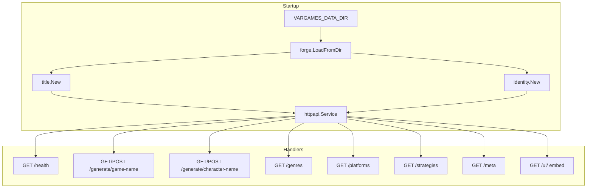

# Plan: HTTP API — Name Generation Service

## Goal

Expose `forge/title` and `forge/identity` over a small HTTP API so game/character name generation can be called programmatically (scripts, games, tools) without shelling out to the CLI.

## Current Foundation

- **CLI:** `generate title` / `generate character` via [`src/cli/generate.go`](../src/cli/generate.go)
- **Generation:** [`src/forge/title`](../src/forge/title/), [`src/forge/identity`](../src/forge/identity/) — M1–M4 implemented
- **Data source:** Pre-fetched JSON in `data/` or `testdata/corpus` (must be present at server startup)
- **No HTTP server code yet;** AGENTS.md suggests `src/httpapi/`

## Design Principles

- **Stdlib first:** `net/http` only — no framework dependency for v1
- **Load once at startup:** Corpus loaded into memory; optional mtime cache (FORGE M7)
- **Stateless handlers:** All variation via query params or JSON body + seed
- **No secrets in responses:** Never expose IGDB credentials via API
- **Same generation logic as CLI:** Handlers delegate to `title.Generator` and `identity.Generator`

## Proposed Architecture



## Package Layout

```
src/httpapi/
  server.go       # Service struct, NewServer, ListenAndServe
  handlers.go     # HTTP handlers
  handlers_test.go
  middleware.go   # request logging, recovery, optional request ID
  response.go     # JSON helpers, error envelope
  ui/             # embed.FS static files (INTERACTIVE-UI)
```

Entry point: `serve` subcommand in [`main.go`](../main.go) via [`src/cli/serve.go`](../src/cli/serve.go) (planned).

```bash
vargames-name-gen serve --addr=:8080 --data-dir=data
```

No IGDB credentials required at runtime.

## Service Facade

```go
type Service struct {
    Corpus    *forge.Corpus
    Titles    *title.Generator
    Identity  *identity.Generator
    LoadedAt  time.Time
}
```

## Endpoints (v1)

### `GET /health`

Liveness/readiness for orchestrators.

**Response 200:**

```json
{
  "status": "ok",
  "corpus_loaded": true,
  "game_count": 350123,
  "character_count": 42000,
  "data_dir": "data",
  "loaded_at": "2026-07-08T19:00:00Z"
}
```

**Response 503** if corpus failed to load or is empty.

### `GET /generate/game-name`

| Query param | Type | Required | Description |
|-------------|------|----------|-------------|
| `genre` | int | no | IGDB genre ID for weighting/filtering |
| `platform` | int | no | IGDB platform ID (M3b; no-op until implemented) |
| `strategy` | string | no | `pick`, `concat`, or default |
| `seed` | string | no | Opaque seed (hashed to int64) |
| `count` | int | no | Names to return (default 1, max 10) |
| `locale` | string | no | Region code (LOCALIZATION; future) |

**Response 200:**

```json
{
  "names": ["Dark Souls: Reborn"],
  "strategy": "concat",
  "seed": "42"
}
```

### `POST /generate/game-name`

Batch-friendly JSON body:

```json
{
  "count": 10,
  "genre": 12,
  "platform": 48,
  "strategy": "concat",
  "seed": "workshop-1"
}
```

Same response shape as GET.

### `GET /generate/character-name` / `POST /generate/character-name`

Same params as game-name. Genre weighting uses character→game→genre join (implemented).

### `GET /genres` / `GET /platforms`

Reference data from loaded corpus (lighter than full `/meta`):

```json
{
  "genres": [{ "id": 12, "name": "Role-playing (RPG)" }]
}
```

### `GET /strategies`

```json
{
  "game_name": ["pick", "concat"],
  "character_name": ["pick", "concat"]
}
```

Updates when Markov (M5) lands.

### `GET /meta`

Full corpus stats:

```json
{
  "entities": ["games", "characters", "genres"],
  "games": 350123,
  "characters": 42000,
  "genres": 23,
  "data_dir": "data",
  "loaded_at": "2026-07-08T19:00:00Z"
}
```

## Configuration

| Name | Default | Description |
|------|---------|-------------|
| `VARGAMES_DATA_DIR` | `testdata/corpus` or `data` | Corpus directory |
| `VARGAMES_HTTP_ADDR` | `:8080` | Listen address |
| `VARGAMES_HTTP_READ_TIMEOUT` | `10s` | Server read timeout |
| `VARGAMES_HTTP_WRITE_TIMEOUT` | `10s` | Server write timeout |
| `VARGAMES_CORS_ORIGIN` | empty | CORS allow-origin (empty = disabled) |

### CLI

```bash
vargames-name-gen serve
vargames-name-gen serve --addr=:9090 --data-dir=./data
```

## Memory Budget (approximate)

| Corpus profile | `games.json` | RAM at startup |
|----------------|--------------|----------------|
| `full` (`fields *`) | ~350 MB | ~400–600 MB |
| `minimal` | ~30–80 MB | ~50–120 MB |
| `testdata/corpus` | ~2 KB | negligible |

See [research/CORPUS-LOADING.md](../research/CORPUS-LOADING.md).

## Error Handling

```json
{
  "error": "invalid genre: not an integer",
  "code": "bad_request"
}
```

| HTTP status | When |
|-------------|------|
| 400 | Bad query params or JSON body |
| 404 | Unknown path |
| 500 | Internal/generation error; `quality_exhausted` |
| 503 | Corpus not loaded |

Batch partial success (NAME-QUALITY): 200 with fewer names + optional `warning` field.

## Middleware (v1)

1. **Recovery** — panic → 500, log stack in verbose mode
2. **Request logging** — method, path, status, duration (no secrets)
3. **CORS** — opt-in via `VARGAMES_CORS_ORIGIN`
4. **Rate limiting** — defer until public deploy; token bucket per IP (document in IGDB-COMPLIANCE)

## Graceful Shutdown

Handle `SIGINT`/`SIGTERM`; drain in-flight requests (30s timeout). Readiness = corpus loaded.

## Testing Strategy

| Test | Approach |
|------|----------|
| Handler unit tests | `httptest.NewRecorder` + generators from `testdata/corpus` |
| Integration test | `httptest.NewServer` + full route table |
| Health check | 503 when corpus empty |
| Param validation | Invalid `genre`, `count` > max |
| Determinism | Same `seed` → same JSON |
| POST body | Batch `count` via JSON |

## Milestones

| Milestone | Deliverable | Depends on | Effort |
|-----------|-------------|------------|--------|
| H1 | `httpapi.Service` skeleton + `/health` | forge M1 | ~0.5 day |
| H2 | `GET /generate/game-name` | forge M2 | ~0.5 day |
| H3 | `GET /generate/character-name` | forge M4 | ~0.25 day |
| H4 | `serve` subcommand + config env vars | H2 | ~0.25 day |
| H5 | Middleware (recovery, logging) | H4 | ~0.5 day |
| H6 | `/meta`, `/genres`, `/platforms`, `count` param | forge M3 | ~0.5 day |
| H7 | `POST` batch endpoints | H2 | ~0.25 day |
| H8 | CORS opt-in | H5 | ~0.25 day |
| H9 | `/strategies`, `/ui/` embed | M5, INTERACTIVE-UI | ~0.5 day |

**Total estimate:** ~3–3.5 days after forge M2 is available.

## Open Decisions

1. **JSON vs plain text** — JSON for v1; add `Accept: text/plain` later?
2. **Auth** — none for local dev; API key header if deployed publicly
3. **Hot reload of corpus** — out of scope for v1; restart server after re-fetch
4. **SSE streaming** — optional `GET /generate/game-name/stream` for UI animation (defer)

## Deployment Notes

- Server is **read-only** over local JSON — pair with fetch workflow or mounted volume
- See [CI-INFRA.md](./CI-INFRA.md) for AWS free-tier hosting
- See [IGDB-COMPLIANCE.md](./IGDB-COMPLIANCE.md) before public deploy

## Related Plans

- [FORGE-PACKAGE.md](./FORGE-PACKAGE.md) — core generation logic (hard dependency)
- [NAME-QUALITY.md](./NAME-QUALITY.md) — prerequisite for public deploy
- [CLI-STRUCTURE.md](./CLI-STRUCTURE.md) — `serve` subcommand (C5)
- [CORPUS-LIFECYCLE.md](./CORPUS-LIFECYCLE.md) — load-at-startup stage
- [OPENAPI.md](./OPENAPI.md) — API contract
- [INTERACTIVE-UI.md](./INTERACTIVE-UI.md) — `/ui/` embed
- [OBSERVABILITY.md](./OBSERVABILITY.md) — request logging, `/metrics`
