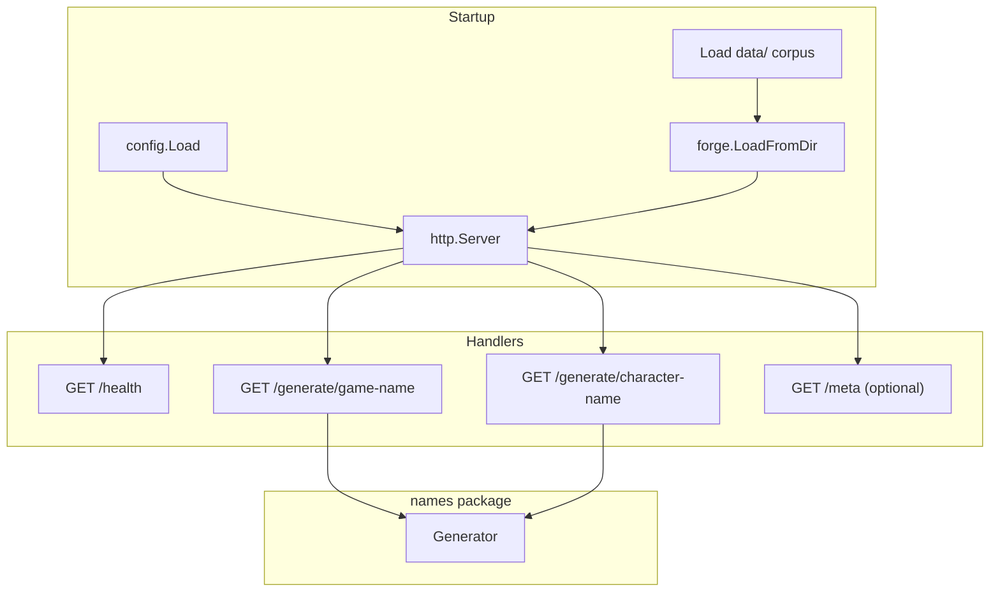

# Plan: HTTP API — Name Generation Service

## Goal

Expose the `names` package over a small HTTP API so game/character name generation can be called programmatically (scripts, games, tools) without shelling out to the CLI.

## Current Foundation

- **CLI only:** `main.go` handles config validation and `-fetch`
- **Planned dependency:** `src/forge/` (see [FORGE-PACKAGE.md](./FORGE-PACKAGE.md)) — API should not be built before names M2 (basic `GenerateGameName`)
- **Data source:** Pre-fetched JSON in `data/` (gitignored locally; must be present at server startup or mounted in deployment)
- **No HTTP server code yet;** AGENTS.md suggests `src/httpapi/` or `src/server/`

## Design Principles

- **Stdlib first:** `net/http` only — no framework dependency for v1
- **Load once at startup:** Corpus loaded into memory; no per-request disk I/O
- **Stateless handlers:** All variation via query params + seed
- **No secrets in responses:** Never expose IGDB credentials via API
- **Same generation logic as CLI:** Handlers delegate to `names.Generator`

## Proposed Architecture



## Package Layout

```
src/httpapi/
  server.go       # Server struct, NewServer, ListenAndServe
  handlers.go     # HTTP handlers
  handlers_test.go
  middleware.go   # request logging, recovery, optional request ID
  response.go     # JSON helpers, error envelope
```

Entry point options:

1. **Subcommand in `main.go`:** `go run . -serve -addr=:8080` (simplest for v1)
2. **Separate binary:** `cmd/server/main.go` (cleaner if CLI and server diverge)

**Recommendation:** Start with `-serve` flag in existing `main.go`; split to `cmd/server` only if `main.go` grows unwieldy.

## Endpoints (v1)

### `GET /health`

Liveness/readiness for orchestrators and load balancers.

**Response 200:**

```json
{
  "status": "ok",
  "corpus_loaded": true,
  "game_count": 350123,
  "character_count": 42000
}
```

**Response 503** if corpus failed to load or is empty.

### `GET /generate/game-name`

| Query param | Type | Required | Description |
|-------------|------|----------|-------------|
| `genre` | int | no | IGDB genre ID for weighting/filtering |
| `platform` | int | no | IGDB platform ID for weighting/filtering |
| `strategy` | string | no | `concat`, `markov`, or default |
| `seed` | string | no | Opaque seed for reproducibility (hashed to int64) |
| `count` | int | no | Number of names to return (default 1, max 10) |

**Response 200:**

```json
{
  "names": ["Dark Souls: Reborn"],
  "strategy": "concat",
  "seed": "42"
}
```

**Response 400:** invalid query params  
**Response 500:** generation failure after retries

### `GET /generate/character-name`

Same query params as game-name (genre/platform weighting may be no-op until names Phase 3).

### `GET /meta` (optional v1.1)

Read-only corpus stats without generating:

```json
{
  "entities": ["games", "characters", "genres"],
  "games": 350123,
  "characters": 42000,
  "genres": 23,
  "data_dir": "data",
  "loaded_at": "2026-07-07T19:00:00Z"
}
```

## Configuration

### New env vars / flags

| Name | Default | Description |
|------|---------|-------------|
| `VARGAMES_DATA_DIR` | `data` | Directory with fetched JSON |
| `VARGAMES_HTTP_ADDR` | `:8080` | Listen address |
| `VARGAMES_HTTP_READ_TIMEOUT` | `10s` | Server read timeout |
| `VARGAMES_HTTP_WRITE_TIMEOUT` | `10s` | Server write timeout |

### CLI

```
go run . -serve
go run . -serve -addr=:9090 -data-dir=./data
```

No IGDB credentials required at runtime if only serving pre-fetched data (fetch remains a separate CLI operation).

## Error Handling

Consistent JSON error envelope:

```json
{
  "error": "invalid genre: not an integer",
  "code": "bad_request"
}
```

| HTTP status | When |
|-------------|------|
| 400 | Bad query params |
| 404 | Unknown path |
| 500 | Internal/generation error |
| 503 | Corpus not loaded |

## Middleware (v1)

1. **Recovery** — panic → 500, log stack in verbose mode
2. **Request logging** — method, path, status, duration (no secrets)
3. **CORS** — opt-in via `VARGAMES_CORS_ORIGIN` (empty = disabled)

Defer auth/rate-limiting until there's a deployment target that needs it.

## Testing Strategy

| Test | Approach |
|------|----------|
| Handler unit tests | `httptest.NewRecorder` + minimal `names.Generator` from test fixtures |
| Integration test | `httptest.NewServer` + `testdata/minimal/` corpus |
| Health check | 503 when generator nil / empty corpus |
| Param validation | Invalid `genre`, `count` > max |
| Determinism | Same `seed` → same JSON response |

No network listeners on random ports in CI — use `httptest` only.

## Milestones

| Milestone | Deliverable | Depends on | Effort |
|-----------|-------------|------------|--------|
| H1 | `httpapi.Server` skeleton + `/health` | names M1 | ~0.5 day |
| H2 | `/generate/game-name` | names M2 | ~0.5 day |
| H3 | `/generate/character-name` | names M4 | ~0.25 day |
| H4 | `-serve` flag + config env vars | H2 | ~0.25 day |
| H5 | Middleware (recovery, logging) | H4 | ~0.5 day |
| H6 | `/meta` + `count` param | names M3 | ~0.5 day |
| H7 | CORS opt-in | H5 | ~0.25 day |

**Total estimate:** ~2–3 days after names M2 is available.

## Open Decisions

1. **JSON vs plain text** — JSON for v1 (easy to consume from any client); add `Accept: text/plain` later?
2. **Separate binary vs `-serve` flag** — start with flag; revisit when adding more subcommands
3. **Auth** — none for local dev; API key header if deployed publicly (see CI-INFRA deployment)
4. **Hot reload of corpus** — out of scope for v1; restart server after re-fetch

## Deployment Notes

- Server is **read-only** over local JSON — pair with fetch workflow or mounted volume
- Memory footprint scales with corpus size (full `games.json` in RAM); document approximate sizes
- See [CI-INFRA.md](./CI-INFRA.md) for GitHub Actions / AWS free-tier hosting options

## Related Plans

- [FORGE-PACKAGE.md](./FORGE-PACKAGE.md) — core generation logic (hard dependency)
- [FETCH-ROBUSTNESS.md](./FETCH-ROBUSTNESS.md) — keeps corpus fresh; meta JSON useful for `/meta`
- [CI-INFRA.md](./CI-INFRA.md) — CI tests for handlers; deployment pipeline
