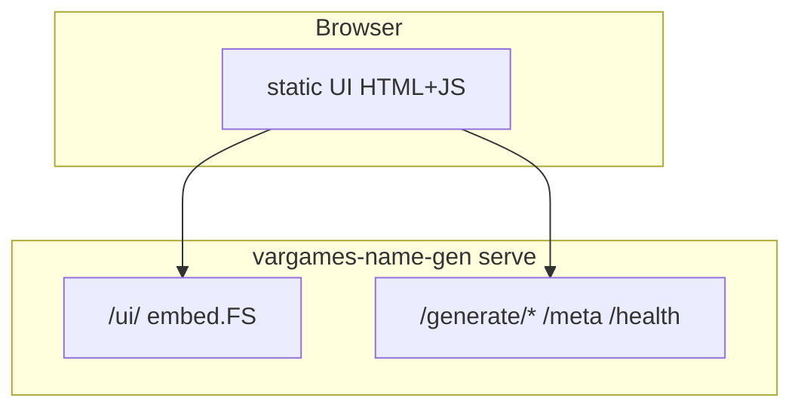

# Plan: Interactive UI — Browser Demo

## Goal

Provide a **simple browser UI** for experimenting with name generation — useful for local demos, stakeholder previews, and as a GitHub Pages front-end when paired with a deployed API.

## Current Foundation

- No UI; CLI and planned HTTP API only
- [HTTP-API.md](./HTTP-API.md) defines JSON endpoints
- [CI-INFRA.md](./CI-INFRA.md) plans GitHub Pages for fetch **reports**, not generation UI
- [SAMPLE-CORPUS.md](./SAMPLE-CORPUS.md) enables offline demo without IGDB credentials

## Proposed Architecture



## UI Scope (v1)

### Controls

| Control | Source |
|---------|--------|
| Type | Game name vs character name |
| Genre | Dropdown from `GET /meta` genre list |
| Platform | Dropdown from `/meta` |
| Strategy | Select: default, concat, markov |
| Seed | Text input (optional) |
| Count | 1–10 |
| Locale | Text/select (when [LOCALIZATION.md](./LOCALIZATION.md) lands) |

### Actions

- **Generate** — call API, display results
- **Copy** — clipboard per result row
- **Regenerate** — same params, new seed

### Display

- Results list with generated names
- Error banner on API failure
- Corpus stats footer (game count, loaded_at from `/health` or `/meta`)

## Implementation Options

| Option | Pros | Cons |
|--------|------|------|
| **A: embed.FS static files** | No build step; served from Go binary | Manual JS |
| **B: Server-rendered Go templates** | Single language | Less interactive |
| **C: Small Vite/React SPA** | Rich UX | Toolchain, build in CI |

**Recommendation:** Option A for v1 — `src/httpapi/ui/` with vanilla HTML + minimal JS (~200 lines).

```
src/httpapi/ui/
  index.html
  app.js
  style.css
```

Embed via `//go:embed ui/*` in `server.go`; mount at `/ui/`.

## Offline Demo Mode

When API base is same origin and corpus is `testdata/corpus`:

- Bundle works without external CDN
- Genre dropdown may have only a few entries — acceptable for demo

For GitHub Pages **static-only** demo (no API): optional mock mode in `app.js` returning canned names — lower priority.

## Styling

- Match dark theme from [`report.go`](../report.go) fetch reports (`#1a1a1a` background, `#4a9eff` accents)
- Responsive enough for phone; desktop-first
- No framework CSS; single `style.css`

## GitHub Pages Deployment

Two deployment patterns:

### Pattern 1: UI + remote API

- Pages hosts static UI only
- `app.js` configures `API_BASE` to deployed AWS/App Runner URL
- CORS required on API ([HTTP-API.md](./HTTP-API.md) `VARGAMES_CORS_ORIGIN`)

### Pattern 2: UI served from API

- No separate Pages deploy; visit `https://api.example.com/ui/`
- Simpler for personal use

Coordinate with [CI-INFRA.md](./CI-INFRA.md) — Pages site can link both fetch reports and UI.

## Milestones

| Milestone | Deliverable | Effort |
|-----------|-------------|--------|
| U1 | Static HTML form + fetch generate endpoint | ~0.5 day |
| U2 | Genre/platform dropdowns from `/meta` | ~0.5 day |
| U3 | embed.FS mount at `/ui/` | ~0.25 day |
| U4 | Copy button + error states | ~0.25 day |
| U5 | Dark theme styling | ~0.5 day |
| U6 | README screenshot + demo instructions | ~0.25 day |
| U7 | GitHub Pages static deploy (optional) | ~0.5 day |

**Total estimate:** ~2.5–3 days.

**Depends on:** HTTP-API H2+, `/meta` for dropdowns (H6); SAMPLE-CORPUS for meaningful local demo.

## Open Decisions

1. **Auth on public UI** — if API is public, UI needs no auth; rate limit at API layer
2. **History** — persist last 10 results in `localStorage`?
3. **Separate repo for UI** — keep in-repo embed for v1

**Recommendation:** Optional `localStorage` history; in-repo embed.

## Risk Register

| Risk | Mitigation |
|------|------------|
| CORS blocks Pages → API | Document CORS env; Pattern 2 avoids |
| UI drift from API | Manual test checklist; OPENAPI examples |
| Exposing UI on public deploy | Same rate limits as API; no admin actions in UI |
| Large `/meta` payload | Paginate or cache genres client-side |

## Related Plans

- [HTTP-API.md](./HTTP-API.md) — backend for UI
- [OPENAPI.md](./OPENAPI.md) — contract reference for fetch URLs
- [SAMPLE-CORPUS.md](./SAMPLE-CORPUS.md) — local demo corpus
- [LOCALIZATION.md](./LOCALIZATION.md) — locale control in UI
- [CI-INFRA.md](./CI-INFRA.md) — GitHub Pages hosting
- [NAME-QUALITY.md](./NAME-QUALITY.md) — UI displays filtered-safe names only
