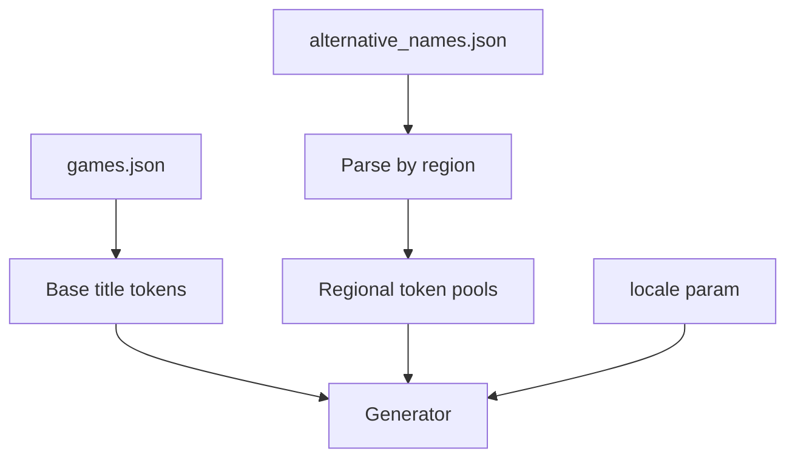

# Plan: Localization — Region-Aware Name Generation

## Goal

Influence generated names by **language or region** using IGDB `alternative_names` and related metadata — so output can skew toward Japanese, European, or other regional naming patterns when requested.

## Current Foundation

- [`alternative_names`](../bruno/alternative_names.yml) entity includes `name`, `game`, and nested `game.name`
- IGDB `comment` field on alternative names often indicates region (e.g. `"EU"`, `"JP"`)
- [FORGE-PACKAGE.md](./FORGE-PACKAGE.md) lists `alternative_names` as mutation tokens, not direct output
- [FETCH-PROFILES.md](./FETCH-PROFILES.md) minimal profile should include `comment` on alt names
- No locale parameter on generation or HTTP API today

## Proposed Architecture



## Locale Model

### Input

| Param | Example | Description |
|-------|---------|-------------|
| `locale` | `jp`, `eu`, `us` | Short region code (normalized lowercase) |
| `region` | alias for locale | HTTP API accepts either; document one canonical |

### Normalization

Map user input to IGDB `comment` values:

```go
var localeAliases = map[string][]string{
    "jp": {"JP", "Japan", "Japanese"},
    "eu": {"EU", "Europe"},
    "us": {"US", "NA", "North America"},
}
```

Fuzzy match `comment` field case-insensitively; log unmatched locales at debug.

### Generation behavior

| `locale` set | Behavior |
|--------------|----------|
| no | Global pool (current default) |
| yes, pool non-empty | 70% regional tokens / 30% global (tunable) |
| yes, pool empty | Fallback to global + verbose warning |

Regional tokens feed **concat/Markov** strategies as additional syllable/word sources — not returned verbatim as commercial alt titles ([NAME-QUALITY.md](./NAME-QUALITY.md) blocklist still applies).

## Data Requirements

### Fetch profile ([FETCH-PROFILES.md](./FETCH-PROFILES.md))

```
alternative_names: fields id,name,game,comment,checksum;
```

### Corpus index extension

```go
type RegionalIndex struct {
    byLocale map[string][]Token  // tokenized fragments from alt names
    byGame   map[int][]string    // alt names per game ID
}
```

Build during `LoadFromDir` alongside main indexes.

## API Surface

### `title.Options` / `identity.Options`

```go
type title.Options struct {
  // ...existing (GenreID, Seed, Strategy)
  Locale string // "" = global (LOCALIZATION)
}
```

### HTTP ([HTTP-API.md](./HTTP-API.md))

```
GET /generate/game-name?locale=jp&seed=1
```

### CLI

```
vargames-name-gen generate game --locale=jp --count=5
```

## Milestones

| Milestone | Deliverable | Effort |
|-----------|-------------|--------|
| L1 | Parse `alternative_names` with `comment` into regional buckets | ~0.5 day |
| L2 | Locale alias map + normalization | ~0.25 day |
| L3 | Weighted pool selection in generator | ~0.5 day |
| L4 | `locale` query param on HTTP + CLI | ~0.25 day |
| L5 | Document coverage limits (sparse regions) | ~0.25 day |
| L6 | `/meta` lists available locales with counts | ~0.5 day |

**Total estimate:** ~2–2.5 days.

**Depends on:** FORGE-PACKAGE M1, FETCH-PROFILES minimal alt_names, NAME-QUALITY Q2.

## Open Decisions

1. **ISO 639-1 vs region codes** — support `ja` mapping to `jp`?
2. **Character names** — IGDB characters lack direct locale; infer from linked games only?
3. **Script detection** — separate pools for Cyrillic, CJK for Markov?

**Recommendation:** Region codes v1; character locale inferred from game alt names; script detection defer to Markov Phase 2.

## Risk Register

| Risk | Mitigation |
|------|------------|
| Sparse `comment` data in IGDB | Fallback to global; document in `/meta` |
| Returning trademarked regional titles | Mutate tokens only; blocklist exact matches |
| Misleading locale (wrong comment) | Soft weighting, not hard filter |
| Encoding issues in alt names | UTF-8 throughout; test with CJK fixtures in SAMPLE-CORPUS |

## Related Plans

- [FORGE-PACKAGE.md](./FORGE-PACKAGE.md) — alternative_names as mutation source
- [FETCH-PROFILES.md](./FETCH-PROFILES.md) — fetch `comment` field
- [NAME-QUALITY.md](./NAME-QUALITY.md) — blocklist on output
- [HTTP-API.md](./HTTP-API.md) — `locale` query param
- [SAMPLE-CORPUS.md](./SAMPLE-CORPUS.md) — include alt_names with varied `comment`
- [EMBEDDED-INDEX.md](./EMBEDDED-INDEX.md) — `alternative_names.comment` indexed
