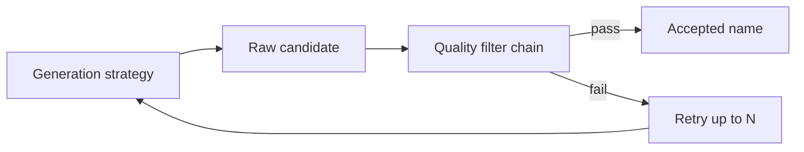

# Plan: Name Quality & Safety Filters

## Goal

Apply post-generation filtering so names returned by the CLI and HTTP API are **safe, non-duplicative, and plausibly usable** — before any public deployment.

## Current Foundation

- [`NAMES-PACKAGE.md`](./NAMES-PACKAGE.md) plans concat/Markov strategies with basic reject rules (length, exact corpus match)
- No dedicated quality layer; no profanity handling; no batch deduplication
- [HTTP-API.md](./HTTP-API.md) will expose generation publicly — quality gates are a prerequisite for deploy

## Proposed Architecture



## Package Layout

```
src/names/
  quality/
    filter.go       # Filter interface, Chain, Options
    length.go       # min/max length, charset rules
    blocklist.go    # exact match against corpus titles
    profanity.go    # embedded word list
    dedup.go        # batch uniqueness
    quality_test.go
```

Or flat: `src/names/filter.go` if the package stays small (prefer subpackage if profanity list is large).

## Filter Rules (v1)

| Rule | Default | Configurable |
|------|---------|--------------|
| Min length | 3 chars | `Quality.MinLen` |
| Max length | 48 chars | `Quality.MaxLen` |
| Charset | Letters, digits, spaces, `: - '` | strict ASCII option |
| Corpus blocklist | Reject exact match to any source title | on by default |
| Profanity | Reject if blocklist word found (case-insensitive, word boundary) | `Quality.Strictness` |
| Batch dedup | No duplicates in multi-name response | always on for `count > 1` |
| Repeated chars | Reject `aaa`, `!!!` patterns | optional |

## Profanity Approach

- **Embedded blocklist** file: `src/names/quality/profanity_en.txt` (or similar)
- No external API calls; works offline
- `go:embed` for the list
- Levels: `off`, `standard`, `strict` (substring vs word-boundary)
- Document that list is best-effort, not comprehensive moderation

## Integration with Generator

```go
type QualityOptions struct {
    MinLen      int
    MaxLen      int
    Profanity   ProfanityLevel
    MaxAttempts int  // per name; default 20
}

func (g *Generator) GameName(opts Options) (string, error) {
    for attempt := 0; attempt < opts.Quality.MaxAttempts; attempt++ {
        name, err := g.strategy.Generate(...)
        if err != nil { return "", err }
        if g.quality.Accept(name) { return name, nil }
    }
    return "", ErrQualityExhausted
}
```

Batch generation (`count=10`): collect accepted names in a set; retry until full or exhausted.

## HTTP API Behavior

| Case | Response |
|------|----------|
| Single name, filter passes | 200 with name |
| Single name, exhausted | 500 `quality_exhausted` |
| Batch, partial success | 200 with fewer names + `warning` field (or 500 if zero) |

Never return a name that failed any enabled filter.

## Configuration

| Env / flag | Description |
|------------|-------------|
| `VARGAMES_PROFANITY=standard` | Profanity level |
| `VARGAMES_MIN_NAME_LEN=3` | Min length |
| `-profanity=off` | CLI override for local dev |

## Milestones

| Milestone | Deliverable | Effort |
|-----------|-------------|--------|
| Q1 | `Filter` interface + length/charset rules | ~0.5 day |
| Q2 | Corpus exact-match blocklist | ~0.25 day |
| Q3 | Batch deduplication | ~0.25 day |
| Q4 | Embedded profanity list + levels | ~0.5 day |
| Q5 | Wire into `Generator` with retry loop | ~0.5 day |
| Q6 | HTTP API error codes + CLI flags | ~0.25 day |

**Total estimate:** ~2–2.5 days.

**Depends on:** [NAMES-PACKAGE.md](./NAMES-PACKAGE.md) M2.

## Open Decisions

1. **Near-match blocklist** — reject Levenshtein-close to famous titles (expensive; defer)?
2. **User-supplied blocklist file** — `VARGAMES_BLOCKLIST_PATH` for game-specific terms?
3. **Log filtered candidates** — verbose mode only; never log profanity matches in production logs?

**Recommendation:** Exact match only for v1; verbose logs show "rejected: length" not the rejected string.

## Risk Register

| Risk | Mitigation |
|------|------------|
| False positives on profanity (e.g. "Scunthorpe") | Word-boundary matching; `off` level for dev |
| All attempts filtered → slow | Cap `MaxAttempts`; cache successful patterns |
| Blocklist maintenance | Small embedded list; issue template for additions |
| Over-filtering makes output boring | Tune defaults with sample corpus; expose levels |

## Related Plans

- [NAMES-PACKAGE.md](./NAMES-PACKAGE.md) — generation strategies feed the filter chain
- [HTTP-API.md](./HTTP-API.md) — must not deploy without Q5+
- [SAMPLE-CORPUS.md](./SAMPLE-CORPUS.md) — quality tests use fixtures
- [CI-INFRA.md](./CI-INFRA.md) — no special CI needs; unit tests only
