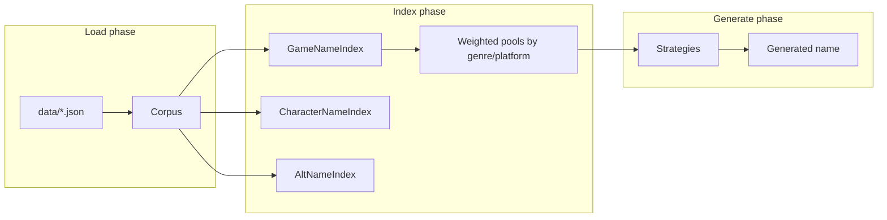

# Plan: `names` Package — Name Generation from IGDB Data

## Goal

Turn fetched JSON in `data/` into a reusable library that can suggest **game names** and **character names**, with optional weighting by genre/platform and reproducible output via seeds.

## Current Foundation

- **Fetch output:** `data/<entity>.json` — arrays of raw IGDB objects
- **Entities with name-like data:** `games`, `characters`, `alternative_names`, `collections`
- **Reference metadata for weighting:** `genres`, `platforms` (and genre/platform IDs on games)
- **No `src/names/` package yet;** `main.go` only handles fetch

## Proposed Architecture



## Package Layout

```
src/names/
  corpus.go       # Load JSON files, parse minimal structs, validate
  index.go        # Build in-memory indexes (by genre, platform, entity type)
  normalize.go    # Strip punctuation, casing rules, tokenization
  strategy.go     # Strategy interface + registry
  concat.go       # Baseline: pick + splice/mutate real titles
  markov.go       # Order-2/3 character or word Markov generator
  generate.go     # Public API: GenerateGameName, GenerateCharacterName
  generate_test.go
  seed.go         # math/rand/v2 or deterministic PRNG from user seed
```

## Data Model (Minimal Structs)

Parse only fields needed for generation and weighting. Do not mirror full IGDB schemas.

| Entity | Fields to extract |
|--------|-------------------|
| `games` | `id`, `name`, `genres[]`, `platforms[]` |
| `characters` | `id`, `name`, `games[]` (for genre inference later) |
| `alternative_names` | `name`, `game` (ID) |
| `genres` | `id`, `name` |
| `platforms` | `id`, `name` |

Keep `json.RawMessage` escape hatches only if a field is missing on some records.

## Public API (v1)

```go
type Options struct {
    GenreID    *int   // filter/weight toward this IGDB genre
    PlatformID *int   // filter/weight toward this platform
    Strategy   string // "concat", "markov", "random" (default: weighted random among available)
    Seed       int64  // 0 = non-deterministic
}

type Generator struct { /* holds Corpus + indexes */ }

func LoadFromDir(dir string) (*Generator, error)
func (g *Generator) GameName(opts Options) (string, error)
func (g *Generator) CharacterName(opts Options) (string, error)
```

## Generation Strategies (Phased)

### Phase 1 — Baseline (ship first)

1. **Reservoir sampling** from a filtered pool (genre/platform match or fallback to all)
2. **Concat / mutate:**
   - Split titles on spaces, `:`, `-`
   - Combine 2 fragments from different titles (e.g. `"Dark"` + `"Souls"`)
   - Light mutations: swap syllables, append roman numerals, subtitle patterns (`: Reborn`, `II`, `Remastered`)
3. **Reject rules:** too short/long, duplicate of source, all-caps noise, empty after normalize

### Phase 2 — Markov

- Build character bigram/trigram models per pool (all games, or per-genre)
- Generate until length 4–40 chars or max attempts
- Filter against a blocklist of exact existing titles (from corpus)

### Phase 3 — Weighting Polish

- Soft weighting: 80% from matching genre, 20% from global pool (tunable)
- `alternative_names` as extra tokens for mutation, not direct output (licensing/accuracy)

## CLI Integration (Thin Wrapper in `main.go`)

```
go run . -generate=game -genre=12 -seed=42
go run . -generate=character -count=5
```

Defer HTTP API until CLI proves the API (see `HTTP-API.md`).

## Testing Strategy

| Test | What it verifies |
|------|------------------|
| `testdata/minimal/` | Tiny JSON fixtures (5–10 records per entity) |
| `LoadFromDir` | Parses, builds indexes, handles missing optional files |
| Determinism | Same seed → same name |
| Weighting | Genre filter changes output distribution (statistical or fixed fixture) |
| Normalize | `"The Legend of Zelda: Breath of the Wild"` tokenizes predictably |

No live IGDB calls in tests.

## Milestones

| Milestone | Deliverable | Effort |
|-----------|-------------|--------|
| M1 | `corpus.go` + `LoadFromDir` + minimal structs | ~1 day |
| M2 | `GenerateGameName` with reservoir + concat | ~1 day |
| M3 | Genre/platform filtering | ~0.5 day |
| M4 | `GenerateCharacterName` | ~0.5 day |
| M5 | Markov strategy | ~1–2 days |
| M6 | CLI flags | ~0.5 day |

**Total estimate:** ~4–6 days for v1 (M1–M4 + CLI).

## Open Decisions

1. **Minimum corpus size** — fail if `games.json` missing, or degrade gracefully?
2. **Character genre weighting** — require joining through `games`, or skip weighting for v1?
3. **Output uniqueness** — guarantee "not in corpus" or allow collisions with low probability?

**Recommendation:** Require `games.json` for game names; allow character-only with `characters.json`. Defer character↔genre joins to Phase 3.

## Dependencies

- Requires fetched data in `data/` (produced by `-fetch` CLI)
- HTTP API (`HTTP-API.md`) depends on this package being stable at M2+

## Related Plans

- [FETCH-ROBUSTNESS.md](./FETCH-ROBUSTNESS.md) — faster/more reliable corpus refresh
- [HTTP-API.md](./HTTP-API.md) — expose generation over HTTP
