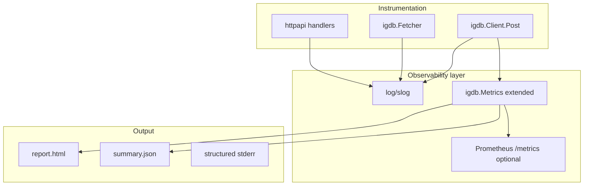

# Plan: Observability — Logging, Metrics & Reporting

## Goal

Close **AGENTS.md item #4**: structured logging, richer per-request metrics, and machine-readable observability — complementing HTML reports and enabling production debugging without logging secrets.

## Current Foundation

| Area | Today |
|------|-------|
| Logging | [`igdb.Logger`](../src/igdb/logger.go) interface; `log.Printf` in `main`; verbose flag |
| Metrics | [`igdb.Metrics`](../src/igdb/metrics.go): endpoint, retries, duration per `Post` |
| Reports | [`report.go`](../report.go): HTML only; retry/duration distributions |
| HTTP | Not implemented; no `/metrics` endpoint |
| Status codes | Not recorded in metrics or reports |

Partial overlap with [FETCH-ROBUSTNESS.md](./FETCH-ROBUSTNESS.md) Phase E (`-summary.json`).

## Proposed Architecture



## Phase 1 — Structured Logging (`log/slog`)

### Scope

Replace ad-hoc `Logf` / `log.Printf` on hot paths with `slog` (stdlib, Go 1.21+).

### Conventions

| Field | Example | Notes |
|-------|---------|-------|
| `level` | `info`, `warn`, `error` | Standard slog |
| `component` | `igdb.client`, `igdb.fetcher`, `httpapi` | Origin package |
| `entity` | `games` | Fetch context |
| `endpoint` | `games` | IGDB path segment |
| `duration_ms` | `234` | Request timing |
| `retries` | `2` | Retry count |
| `status` | `200` | HTTP status when available |
| `page` | `12` | Fetcher page number |

**Never log:** `ClientID`, `ClientSecret`, tokens, full response bodies.

### Migration path

1. Add `slog.Default()` wrapper or `igdb.SlogLogger` implementing existing `Logger` interface
2. `LoggerFromVerbose` returns slog-backed logger when verbose
3. Deprecate `VerboseLogger` string formatting gradually

## Phase 2 — Extended Metrics

### `PostRecord` additions

```go
type PostRecord struct {
    Endpoint  string
    Retries   int
    Duration  time.Duration
    StatusCode int       // 0 if transport error before response
    ErrorClass string    // "", "rate_limit", "server", "client", "transport"
}
```

Populate in [`client.go`](../src/igdb/client.go) `Post` from HTTP response or error type.

### Report enhancements ([`report.go`](../report.go))

- New HTML section: **Status code distribution** (200, 429, 502, …)
- New HTML section: **Error class breakdown**
- Align fields with `data/<entity>-summary.json` (FETCH-ROBUSTNESS E)

### `summary.json` schema (shared with FETCH-ROBUSTNESS)

```json
{
  "entity": "games",
  "requests": 700,
  "total_retries": 12,
  "status_codes": { "200": 695, "429": 5 },
  "error_classes": { "rate_limit": 5 },
  "duration_ms": { "p50": 320, "p95": 890, "max": 2100 }
}
```

## Phase 3 — Prometheus Endpoint (Optional)

Expose on HTTP server when `VARGAMES_METRICS=1`:

```
GET /metrics
```

Counters/histograms (example):

- `vargames_igdb_requests_total{endpoint,status}`
- `vargames_igdb_request_duration_seconds{endpoint}`
- `vargames_generate_requests_total{type,strategy}`
- `vargames_generate_duration_seconds{type}`

Use `prometheus/client_golang` only if dependency is acceptable; otherwise defer.

**Recommendation:** Defer Prometheus until HTTP API deploy; Phase 1–2 have no new dependencies.

## Phase 4 — HTTP Request Logging

Middleware in [HTTP-API.md](./HTTP-API.md):

- Log: method, path, status, duration_ms, request_id (UUID)
- Do not log query params that might contain PII (seeds are OK)

## Milestones

| Milestone | Deliverable | Effort |
|-----------|-------------|--------|
| O1 | `slog` integration behind `igdb.Logger` | ~0.5 day |
| O2 | Status code + error class on `PostRecord` | ~0.5 day |
| O3 | HTML report status section | ~0.25 day |
| O4 | `summary.json` writer (shared with FETCH-ROBUSTNESS E) | ~0.5 day |
| O5 | HTTP middleware request logging | ~0.25 day |
| O6 | Prometheus `/metrics` (optional) | ~1 day |

**Total estimate:** ~2–3 days (O1–O5); +1 day for O6.

## Open Decisions

1. **JSON logs in production** — `slog` JSON handler vs text for local dev?
2. **Log level from env** — `VARGAMES_LOG_LEVEL=debug`?
3. **Prometheus dependency** — add `client_golang` or skip O6 indefinitely?

**Recommendation:** Text slog locally; JSON when `VARGAMES_LOG_FORMAT=json`; skip Prometheus until deploy.

## Risk Register

| Risk | Mitigation |
|------|------------|
| Secret leakage in structured logs | Code review checklist; never log Authorization headers |
| Log volume on full fetch | Info per page not per retry; debug for retries |
| Duplicate summary JSON logic | Single `report` package or shared writer used by main + fetcher |

## Related Plans

- [FETCH-ROBUSTNESS.md](./FETCH-ROBUSTNESS.md) — Phase E shares `summary.json`
- [HTTP-API.md](./HTTP-API.md) — O5/O6 attach to server
- [CI-INFRA.md](./CI-INFRA.md) — CI does not need metrics; tests verify record shape
- [TEST-COVERAGE.md](./TEST-COVERAGE.md) — assert status codes recorded in client tests
