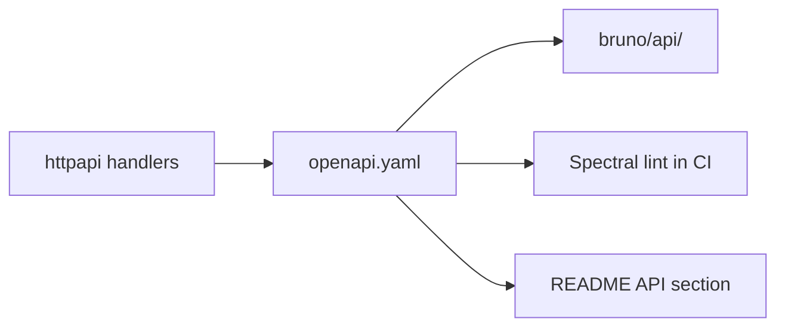

# Plan: OpenAPI Spec & API Documentation

## Goal

Provide a **machine-readable contract** for the HTTP name-generation service, plus a Bruno collection for local testing — keeping docs in sync with [HTTP-API.md](./HTTP-API.md) handlers.

## Current Foundation

- HTTP API is planned, not implemented ([HTTP-API.md](./HTTP-API.md))
- Bruno collections exist for **IGDB** under [`bruno/`](../bruno/) (games, genres, auth, counts)
- No OpenAPI spec; no Bruno collection for the local vargames API

## Proposed Architecture



## Artifacts

```
openapi.yaml              # OpenAPI 3.0 root spec
bruno/
  api/
    opencollection.yml
    health.yml
    generate-game-name.yml
    generate-character-name.yml
    meta.yml
```

## OpenAPI Spec (v1)

### Info

```yaml
openapi: 3.0.3
info:
  title: Vargames Name Gen API
  version: 0.1.0
  description: Generate game and character names from an IGDB-derived corpus
```

### Paths

| Path | Method | Operation ID |
|------|--------|--------------|
| `/health` | GET | getHealth |
| `/generate/game-name` | GET, POST | generateGameName |
| `/generate/character-name` | GET, POST | generateCharacterName |
| `/genres` | GET | listGenres |
| `/platforms` | GET | listPlatforms |
| `/strategies` | GET | listStrategies |
| `/meta` | GET | getMeta |

### Shared parameters

Query params: `genre` (int), `platform` (int), `strategy` (string), `seed` (string), `count` (int, max 10), `locale` (string, LOCALIZATION).

POST body (`GenerateRequest`):

```yaml
GenerateRequest:
  type: object
  properties:
    count: { type: integer, maximum: 10 }
    genre: { type: integer }
    platform: { type: integer }
    strategy: { type: string, enum: [pick, concat] }
    seed: { type: string }
    locale: { type: string }
```

### Response schemas

```yaml
components:
  schemas:
    HealthResponse:
      type: object
      properties:
        status: { type: string }
        corpus_loaded: { type: boolean }
        game_count: { type: integer }
        character_count: { type: integer }
        data_dir: { type: string }
        loaded_at: { type: string, format: date-time }
    GenerateResponse:
      type: object
      properties:
        names: { type: array, items: { type: string } }
        strategy: { type: string }
        seed: { type: string }
        warning: { type: string, description: "Partial batch success (NAME-QUALITY)" }
    ErrorResponse:
      type: object
      properties:
        error: { type: string }
        code: { type: string, enum: [bad_request, quality_exhausted, internal] }
```

### Servers

```yaml
servers:
  - url: http://localhost:8080
    description: Local development
```

## Maintenance Strategy

### v1: Hand-written spec

- Author `openapi.yaml` alongside HTTP-API implementation
- PR checklist: "update openapi.yaml if handlers changed"

### v2 (optional): Code-generated

- Annotations on handlers → `go generate` with `swag` or similar
- Only if hand-written drift becomes painful

**Recommendation:** Hand-written for v1; small API surface.

## Bruno Collection

Mirror IGDB Bruno style under `bruno/api/`:

- Environment: `base_url: http://localhost:8080`
- Requests match OpenAPI paths and query examples
- Useful for manual QA after `vargames-name-gen serve` (not `-serve` flag)

## CI Integration

Optional job step ([CI-INFRA.md](./CI-INFRA.md)):

```bash
npx @stoplight/spectral-cli lint openapi.yaml
```

Fail PR if spec is invalid YAML or violates style rules (no trailing slashes, etc.).

Do not require spec-to-implementation diff tooling in v1.

## Milestones

| Milestone | Deliverable | Effort |
|-----------|-------------|--------|
| A1 | `openapi.yaml` v0.1 matching HTTP-API H2 endpoints | ~0.5 day |
| A2 | `bruno/api/` collection | ~0.25 day |
| A3 | README "API" section with link to spec | ~0.1 day |
| A4 | Spectral lint in CI | ~0.25 day |
| A5 | Add `/genres`, `/platforms`, `/strategies`, POST bodies | ~0.25 day |

**Total estimate:** ~1–1.5 days.

**Depends on:** [HTTP-API.md](./HTTP-API.md) H2+.

## Open Decisions

1. **Spec location** — repo root vs `api/openapi.yaml`?
2. **Versioning** — URL prefix `/v1/generate/...` or unversioned for now?
3. **Examples in spec** — include sample `names` arrays for codegen users?

**Recommendation:** `openapi.yaml` at repo root; unversioned v0.1; include examples.

## Risk Register

| Risk | Mitigation |
|------|------------|
| Spec drifts from code | PR checklist; Bruno manual smoke test |
| Over-specifying unstable API | Mark v0.1 as beta in `info.version` |
| Spectral noise | Minimal ruleset |

## Related Plans

- [HTTP-API.md](./HTTP-API.md) — implementation source of truth for behavior
- [CI-INFRA.md](./CI-INFRA.md) — Spectral in CI
- [INTERACTIVE-UI.md](./INTERACTIVE-UI.md) — UI may reference OpenAPI for client codegen later
- [TEST-COVERAGE.md](./TEST-COVERAGE.md) — contract tests optional future work
