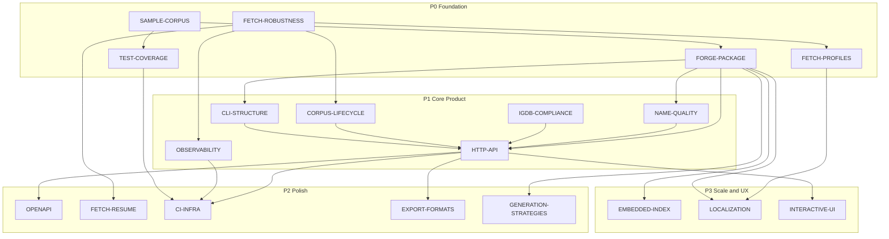

# Planning Roadmap

Design and implementation plans for **vargames-name-gen**. Each document is self-contained with goals, architecture, milestones, and cross-links.

For project overview and setup, see the root [README.md](../README.md) and [AGENTS.md](../AGENTS.md).

---

## Implementation Snapshot

*Last synced with codebase — use this table to orient before coding.*

| Component | Done | Not yet |
|-----------|------|---------|
| **Fetch** | Concurrent paging, `-partial`, `-incremental`, profiles, meta/checksums/reports | `fetch` subcommand, resume, JSON summaries (Phase E), D2 threshold |
| **Forge load** | `LoadFromDir`, 7 entities, `testdata/corpus` | Lazy load, mtime cache, SQLite |
| **Title gen** | `GameTitle`, `pick`/`concat`, genre filter | `CollectionTitle`, Markov, platform weight, CLI `-genre` |
| **Identity gen** | `CharacterName`, genre join, `pick`/`concat` | `CompanyName`, Markov |
| **CLI** | `generate title\|character`, `cmd/forge` | `fetch`, `serve`, `validate`, `list`, export |
| **HTTP API** | — | Entire `src/httpapi/` package |
| **Quality** | Q0 `RejectTitle` | `forge/quality` profanity, dedup |
| **CI** | `go fix` + `go test ./...` | vet, coverage, Pages, fetch workflow |

**Default corpus dir:** `VARGAMES_DATA_DIR` → `testdata/corpus` (if `games.json` exists) → `data/`.

**Package map:** `config` · `igdb` · `forge` / `forge/title` · `forge/identity` · `cli` · `main` (+ `fetchmeta`, `report`) · `cmd/forge`

---

## Plan Index

| Plan | One-liner | Priority | Status |
|------|-----------|----------|--------|
| [FETCH-ROBUSTNESS.md](./FETCH-ROBUSTNESS.md) | Concurrent fetch, partial results, incremental sync | P0 | ~90% (Phase E, D2 pending) |
| [FETCH-PROFILES.md](./FETCH-PROFILES.md) | Per-entity IGDB field selection | P0 | ~85% (P5 per-entity overrides pending) |
| [FORGE-PACKAGE.md](./FORGE-PACKAGE.md) | Procedural generation (`forge`, `title`, `identity`) | P0 | ~70% (M1–M4 + partial M6) |
| [SAMPLE-CORPUS.md](./SAMPLE-CORPUS.md) | Offline dev corpus without IGDB credentials | P0 | ~95% (S6–S7 pending) |
| [TEST-COVERAGE.md](./TEST-COVERAGE.md) | Test strategy and client gap closure | P0 | ~40% (T2 client gaps, CI hardening) |
| [CORPUS-LIFECYCLE.md](./CORPUS-LIFECYCLE.md) | End-to-end fetch → load → generate flow | P1 | Doc ✓ |
| [NAME-QUALITY.md](./NAME-QUALITY.md) | Safety filters on generated names | P1 | ~10% (Q0 in `RejectTitle`) |
| [CLI-STRUCTURE.md](./CLI-STRUCTURE.md) | Subcommand-based CLI | P1 | ~35% (`generate` done; `fetch` pending) |
| [OBSERVABILITY.md](./OBSERVABILITY.md) | Structured logs, metrics, Prometheus | P1 | 0% |
| [HTTP-API.md](./HTTP-API.md) | REST generation service | P1 | 0% |
| [IGDB-COMPLIANCE.md](./IGDB-COMPLIANCE.md) | ToS, attribution, rate-limit policy | P1 | Doc ✓; impl 0% |
| [EXPORT-FORMATS.md](./EXPORT-FORMATS.md) | CSV/JSONL export of generated names | P2 | Doc ✓; impl 0% |
| [GENERATION-STRATEGIES.md](./GENERATION-STRATEGIES.md) | Strategy registry and plugin interface | P2 | Doc ✓; pick/concat inline only |
| [OPENAPI.md](./OPENAPI.md) | API spec and Bruno collection | P2 | 0% |
| [FETCH-RESUME.md](./FETCH-RESUME.md) | Checkpoint and resume interrupted fetches | P2 | 0% |
| [CI-INFRA.md](./CI-INFRA.md) | CI hardening, GitHub Pages, AWS deploy | P2 | ~25% (basic CI only) |
| [EMBEDDED-INDEX.md](./EMBEDDED-INDEX.md) | Optional SQLite corpus store | P3 | 0% (deferred) |
| [LOCALIZATION.md](./LOCALIZATION.md) | Region-aware name generation | P3 | 0% |
| [INTERACTIVE-UI.md](./INTERACTIVE-UI.md) | Browser demo UI | P3 | 0% |

---

## Research

Decision-support documents (not implementation plans). Action items from research should land in planning milestones above.

| Document | Topic |
|----------|-------|
| [research/APICALYPSE.md](../research/APICALYPSE.md) | IGDB query language reference |
| [research/CORPUS-LOADING.md](../research/CORPUS-LOADING.md) | `LoadFromDir` performance, cache options (→ FORGE M7) |
| [research/DATABASE.md](../research/DATABASE.md) | JSON vs SQLite vs Postgres progression |

---

## Dependency Graph

---

## Suggested Execution Order

### Wave 1 — Data pipeline and test foundation (~90% complete)

1. ~~[FETCH-ROBUSTNESS.md](./FETCH-ROBUSTNESS.md) Phase A–D~~ — concurrent fetch, partial, meta, incremental
2. ~~[FETCH-PROFILES.md](./FETCH-PROFILES.md) minimal profiles~~ — default `minimal` profile
3. ~~[SAMPLE-CORPUS.md](./SAMPLE-CORPUS.md) fixtures~~ — `testdata/corpus/` + README committed
4. [TEST-COVERAGE.md](./TEST-COVERAGE.md) client gap tests + CI vet/build

**Remaining from Wave 1:** Phase E JSON summaries; FETCH-PROFILES P5 per-entity overrides; FETCH-ROBUSTNESS D2 full re-pull threshold; re-benchmark lean JSON ([CORPUS-LOADING](../research/CORPUS-LOADING.md)).

### Wave 2 — Name generation (~50% complete)

5. ~~[FORGE-PACKAGE.md](./FORGE-PACKAGE.md) M1–M4~~ — load, title concat/pick, genre filter, character names
6. [FORGE-PACKAGE.md](./FORGE-PACKAGE.md) M7 corpus cache; M3b platform weighting; title CLI `-genre`
7. [NAME-QUALITY.md](./NAME-QUALITY.md) filters before any public API
8. [CLI-STRUCTURE.md](./CLI-STRUCTURE.md) `fetch` subcommand migration; `validate` / `list`
9. [OBSERVABILITY.md](./OBSERVABILITY.md) slog + status in metrics/reports

### Wave 3 — API and automation

10. ~~[IGDB-COMPLIANCE.md](./IGDB-COMPLIANCE.md) doc~~ — implement C2–C4 (attribution) before public deploy
11. [HTTP-API.md](./HTTP-API.md) `serve` + generate endpoints
12. [OPENAPI.md](./OPENAPI.md) spec + Bruno
13. [CI-INFRA.md](./CI-INFRA.md) Pages for reports; hardened CI

### Wave 4 — Resilience and UX

14. [FETCH-ROBUSTNESS.md](./FETCH-ROBUSTNESS.md) Phase E (JSON summary reports)
15. [FETCH-RESUME.md](./FETCH-RESUME.md) checkpoints
16. [INTERACTIVE-UI.md](./INTERACTIVE-UI.md) embedded `/ui/`
17. [LOCALIZATION.md](./LOCALIZATION.md) locale-aware pools
18. [EXPORT-FORMATS.md](./EXPORT-FORMATS.md) batch output formats
19. [EMBEDDED-INDEX.md](./EMBEDDED-INDEX.md) only if profiling demands it

---

## Out of Scope (for now)

- Adaptive rate limiting based on 429 frequency (see [IGDB-COMPLIANCE.md](./IGDB-COMPLIANCE.md) for manual guidance)
- WASM/browser-local generation without API
- Full PostgreSQL deployment (see [research/DATABASE.md](../research/DATABASE.md))

---

## Document Conventions

All plans follow a common structure:

- **Goal** — what success looks like
- **Current Foundation** — what exists today
- **Architecture** — mermaid diagrams where helpful
- **Milestones** — phased delivery with effort estimates
- **Open Decisions** — unresolved choices with recommendations
- **Risk Register** — mitigations
- **Related Plans** — cross-links

Update plans when implementation changes structural decisions (see AGENTS.md maintenance note).
