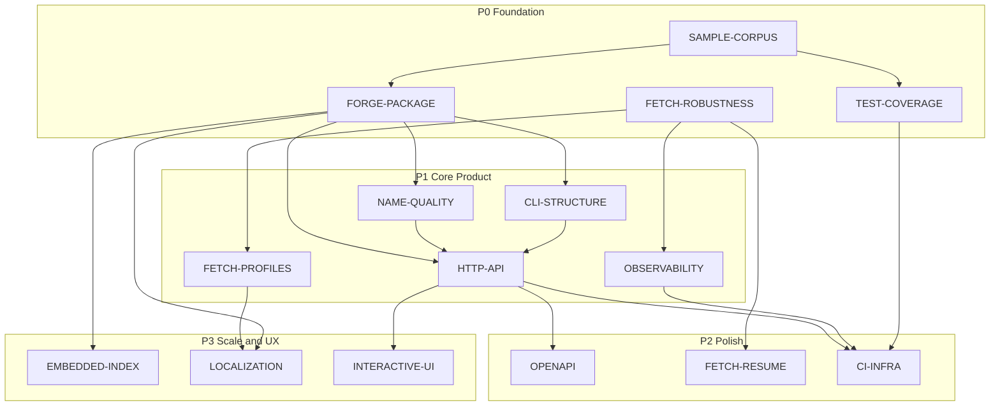

# Planning Roadmap

Design and implementation plans for **vargames-name-gen**. Each document is self-contained with goals, architecture, milestones, and cross-links.

For project overview and setup, see the root [README.md](../README.md) and [AGENTS.md](../AGENTS.md).

---

## Plan Index

| Plan | One-liner | Priority |
|------|-----------|----------|
| [FETCH-ROBUSTNESS.md](./FETCH-ROBUSTNESS.md) | Concurrent fetch, partial results, incremental sync | P0 |
| [FORGE-PACKAGE.md](./FORGE-PACKAGE.md) | Procedural generation library (`forge`, `title`, `identity`) | P0 |
| [SAMPLE-CORPUS.md](./SAMPLE-CORPUS.md) | Offline dev corpus without IGDB credentials | P0 |
| [TEST-COVERAGE.md](./TEST-COVERAGE.md) | Test strategy and client gap closure | P0 |
| [FETCH-PROFILES.md](./FETCH-PROFILES.md) | Per-entity IGDB field selection | P1 |
| [NAME-QUALITY.md](./NAME-QUALITY.md) | Safety filters on generated names | P1 |
| [CLI-STRUCTURE.md](./CLI-STRUCTURE.md) | Subcommand-based CLI | P1 |
| [OBSERVABILITY.md](./OBSERVABILITY.md) | Structured logs, metrics, Prometheus | P1 |
| [HTTP-API.md](./HTTP-API.md) | REST generation service | P1 |
| [OPENAPI.md](./OPENAPI.md) | API spec and Bruno collection | P2 |
| [FETCH-RESUME.md](./FETCH-RESUME.md) | Checkpoint and resume interrupted fetches | P2 |
| [CI-INFRA.md](./CI-INFRA.md) | CI hardening, GitHub Pages, AWS deploy | P2 |
| [EMBEDDED-INDEX.md](./EMBEDDED-INDEX.md) | Optional SQLite corpus store | P3 |
| [LOCALIZATION.md](./LOCALIZATION.md) | Region-aware name generation | P3 |
| [INTERACTIVE-UI.md](./INTERACTIVE-UI.md) | Browser demo UI | P3 |

---

## Dependency Graph

---

## Suggested Execution Order

### Wave 1 — Data pipeline and test foundation

1. [FETCH-ROBUSTNESS.md](./FETCH-ROBUSTNESS.md) Phase A (concurrent fetch + config)
2. [SAMPLE-CORPUS.md](./SAMPLE-CORPUS.md) fixtures (can start in parallel)
3. [TEST-COVERAGE.md](./TEST-COVERAGE.md) client gap tests + CI vet/build
4. [FETCH-PROFILES.md](./FETCH-PROFILES.md) minimal profiles

### Wave 2 — Name generation

5. [FORGE-PACKAGE.md](./FORGE-PACKAGE.md) M1–M4 (load, title concat, genre filter, identity)
6. [NAME-QUALITY.md](./NAME-QUALITY.md) filters before any public API
7. [CLI-STRUCTURE.md](./CLI-STRUCTURE.md) `fetch` + `generate` subcommands
8. [OBSERVABILITY.md](./OBSERVABILITY.md) slog + status in metrics/reports

### Wave 3 — API and automation

9. [HTTP-API.md](./HTTP-API.md) serve + generate endpoints
10. [OPENAPI.md](./OPENAPI.md) spec + Bruno
11. [CI-INFRA.md](./CI-INFRA.md) Pages for reports; hardened CI
12. [FETCH-ROBUSTNESS.md](./FETCH-ROBUSTNESS.md) Phase B–C (partial, meta JSON)

### Wave 4 — Resilience and UX

13. [FETCH-RESUME.md](./FETCH-RESUME.md) checkpoints
14. [INTERACTIVE-UI.md](./INTERACTIVE-UI.md) embedded `/ui/`
15. [LOCALIZATION.md](./LOCALIZATION.md) locale-aware pools
16. [EMBEDDED-INDEX.md](./EMBEDDED-INDEX.md) only if profiling demands it

---

## Out of Scope (for now)

Lower-priority items from roadmap review — add plans if needed:

- IGDB Terms of Service / attribution documentation
- Export formats (CSV of generated names)
- Adaptive rate limiting based on 429 frequency
- Plugin registry for third-party generation strategies

---

## Document Conventions

All plans follow a common structure:

- **Goal** — what success looks like
- **Current Foundation** — what exists today
- **Architecture** — mermaid diagrams where helpful
- **Milestones** — phased delivery with effort estimates
- **Open Decisions** — unresolved choices with recommendations
- **Risk Register** — mitigations
- **Related Plans** — cross-links

Update plans when implementation changes structural decisions (see AGENTS.md maintenance note).
