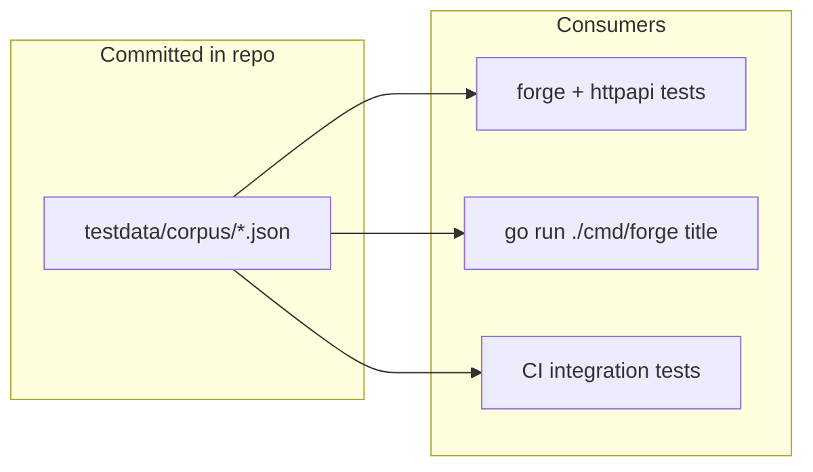

# Plan: Sample / Offline Corpus

## Goal

Let developers and CI run the `forge` package and HTTP handlers **without IGDB credentials** or a multi-hour fetch, using a small committed corpus with valid IGDB-shaped JSON.

## Current Foundation

- **Production data:** `data/` is gitignored; requires `-fetch` with Twitch credentials
- **Fixtures:** `testdata/corpus/` — all 7 entity JSON files committed (~10 games, 10 characters, etc.)
- **Tests:** [`corpus_test.go`](../src/forge/corpus_test.go) and [`forge.TestCorpusDir`](../src/forge/testutil.go) use fixtures
- **Consumer:** [`forge.LoadFromDir`](./FORGE-PACKAGE.md) (M1 implemented); default data dir prefers `testdata/corpus`

## Proposed Architecture



## Directory Layout

```
testdata/corpus/
  games.json              # 10–20 records with id, name, genres, platforms
  characters.json         # 10–20 records with id, name
  genres.json             # all or subset of IGDB genres (~20)
  platforms.json          # subset of platforms
  alternative_names.json  # optional; 5–10 alt names linked to sample games
  collections.json        # optional; 3–5 records
  companies.json          # optional; 3–5 records
  README.md               # describes fixture provenance and refresh process
```

## Fixture Requirements

| Requirement | Detail |
|-------------|--------|
| **Shape** | Valid IGDB API response arrays; fields match what `forge` minimal structs expect |
| **Size** | Small enough to commit (< 100 KB total); 5–20 records per entity |
| **Content** | Hand-crafted or truncated from public domain / well-known titles; no secrets |
| **Coverage** | At least 3 genres and 2 platforms represented in `games.json` for weighting tests |
| **Provenance** | `testdata/corpus/README.md` documents how fixtures were created and when to refresh |

## Integration Points

### `forge` package

- `LoadFromDir("testdata/corpus")` must succeed with only required files present
- Tests default to `testdata/corpus` via helper `forge.TestCorpusDir(t)`

### CLI

```bash
go run ./cmd/forge title -data-dir=testdata/corpus -seed=1
go run . generate title -seed=1
```

No IGDB credentials required for either command.

Document in root README under a "Try without credentials" section (pointer only; no duplicate setup steps).

### HTTP API

- Integration tests start server with `testdata/corpus`
- `/health` reports counts matching fixture sizes

### CI

- No IGDB secrets required for forge/httpapi integration tests
- See [TEST-COVERAGE.md](./TEST-COVERAGE.md) and [CI-INFRA.md](./CI-INFRA.md)

## Milestones

| Milestone | Deliverable | Effort | Status |
|-----------|-------------|--------|--------|
| S1 | `testdata/corpus/` JSON fixtures for games, genres, platforms, characters | ~0.5 day | **Done** |
| S2 | Optional fixtures: alternative_names, collections, companies | ~0.25 day | **Done** |
| S3 | `testdata/corpus/README.md` with provenance | ~0.25 day | **Done** |
| S4 | `forge` loader tests against fixtures | ~0.25 day | **Done** |
| S5 | Root README pointer to sample corpus workflow | ~0.1 day | **Done** |
| S6 | CJK alt-name fixtures for LOCALIZATION tests | ~0.25 day | Pending |
| S7 | `scripts/truncate-corpus.sh` to slice `data/` → fixtures | ~0.25 day | Pending |

**Total estimate:** ~1–1.5 days (S1–S2, S4–S5 complete; S3, S6–S7 remain).

## Open Decisions

1. **Real vs synthetic names** — use recognizable titles (Zelda, Mario) for clarity, or fully synthetic strings?
2. **Fixture refresh** — manual only, or script to truncate a local `data/` fetch into fixtures?
3. **Version field** — add `_corpus_version` in a manifest JSON for test stability?

**Recommendation:** Recognizable-but-minimal titles; manual refresh via documented script when IGDB schema changes.

## Risk Register

| Risk | Mitigation |
|------|------------|
| Fixtures drift from real IGDB schema | Loader tolerates optional fields; add schema smoke test |
| Corpus too small for Markov | Markov tests use separate larger fixture in `testdata/markov/` if needed |
| Accidental commit of real `data/` | `.gitignore` unchanged; corpus README warns against copying secrets |

## Related Plans

- [FORGE-PACKAGE.md](./FORGE-PACKAGE.md) — primary consumer (M1 dependency)
- [HTTP-API.md](./HTTP-API.md) — integration tests use sample corpus
- [TEST-COVERAGE.md](./TEST-COVERAGE.md) — fixture conventions
- [INTERACTIVE-UI.md](./INTERACTIVE-UI.md) — offline demo mode
