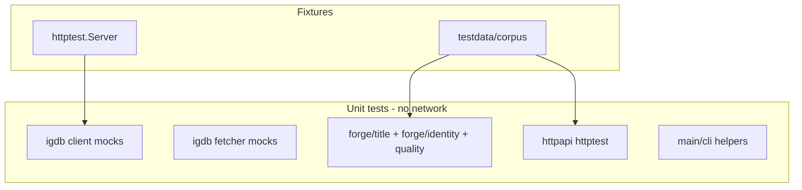

# Plan: Test Coverage — Strategy & Gap Closure

## Goal

Close the README "Client unit tests" checklist, document repo-wide testing conventions, and align CI with meaningful coverage targets — without live IGDB network calls.

## Current Foundation

### Existing tests

| Package | File | Coverage |
|---------|------|----------|
| `igdb` | [`client_test.go`](../src/igdb/client_test.go) | Post success, retries, 429, token refresh, context cancel, metrics, max retry duration |
| `igdb` | [`fetcher_test.go`](../src/igdb/fetcher_test.go) | Paging, concurrent, empty response, partial mode |
| `igdb` | [`incremental_test.go`](../src/igdb/incremental_test.go) | Checksum diff, merge, batch ID fetch |
| `igdb` | [`profiles_test.go`](../src/igdb/profiles_test.go) | Profile registry |
| `forge` | [`corpus_test.go`](../src/forge/corpus_test.go) | LoadFromDir, benchmarks |
| `forge/title` | [`game_title_test.go`](../src/forge/title/game_title_test.go) | Determinism, genre filter, strategies |
| `forge/identity` | [`character_name_test.go`](../src/forge/identity/character_name_test.go) | Determinism, genre join |
| `cli` | [`generate_test.go`](../src/cli/generate_test.go) | Generate determinism, data dir resolution |
| `main` | [`main_test.go`](../main_test.go) | `writeEntityResultsJSON` |

### README gap checklist vs reality

Moved from root README — track in this plan only:

| README item | Status |
|-------------|--------|
| Token caching: only fetch token once across two `Post` calls | **Gap** — refresh tested, but not "single token fetch across two Posts" |
| Token error: empty `access_token` | **Gap** |
| Retry eligibility: 429 → retries → success | **Covered** (`TestPost_RetriesOn429`, `TestPost_RetryThenSuccess`) |
| Context cancellation mid-retry | **Covered** (`TestPost_ContextCanceled`) |
| Header correctness: `Content-Type`, `Client-Id` on every call | **Partial** — success test checks headers; not generalized across retries |

### CI

[`.github/workflows/ci-tests.yml`](../.github/workflows/ci-tests.yml) runs `go test -v ./...` on push/PR. No vet, race, or coverage yet ([CI-INFRA.md](./CI-INFRA.md) C1).

## Proposed Architecture



## Test Conventions

### Layout

```
testdata/
  corpus/           # SAMPLE-CORPUS fixtures
  igdb/             # optional: canned HTTP responses for client
  markov/           # optional: larger corpus for Markov tests
```

### Naming

- `Test<Function>_<Scenario>` (existing style)
- Table-driven where ≥3 cases
- Use `t.Parallel()` where safe (no shared mutable state)

### Mocks

- `igdb` client: `httptest.Server` (existing pattern in `client_test.go`)
- `FetcherClient` interface for fetcher tests (existing)
- No third-party mock frameworks

## Gap Closure — Client Tests

| Test to add | Assertion |
|-------------|-----------|
| `TestPost_TokenFetchedOnce` | Two `Post` calls with large `expires_in`; token endpoint hit once |
| `TestPost_EmptyAccessToken` | Token 200 body without `access_token` → error containing "access_token" |
| `TestPost_HeadersOnRetry` | 429 then 200; both requests have `Client-Id` and `Content-Type: text/plain` |

## Coverage Targets (aspirational)

| Package | Target | Priority |
|---------|--------|----------|
| `src/igdb` | ≥ 80% | P0 |
| `src/forge` | ≥ 75% | P0 |
| `src/forge/title` | ≥ 75% | P0 |
| `src/forge/identity` | ≥ 75% | P0 |
| `src/httpapi` | ≥ 70% | P1 |
| `src/cli` | ≥ 60% | P1 |
| `main` | smoke tests for dispatch | P2 |

Measure with `go test -coverprofile=coverage.out ./...`.

## CI Enhancements (coordinate with CI-INFRA C1)

| Step | Command |
|------|---------|
| Vet | `go vet ./...` |
| Format check | `test -z "$(gofmt -l .)"` |
| Build | `go build -o /dev/null .` |
| Test | `go test ./...` |
| Coverage | `go test -coverprofile=coverage.out ./...`; upload artifact |
| Race (post concurrent fetch) | `go test -race ./src/igdb/...` |

## Future Package Tests

| Package | Key tests |
|---------|-----------|
| `forge` | `LoadFromDir`, missing optional files, `TestCorpusDir` |
| `forge/title` | `GameTitle` determinism, genre filter, concat/pick strategies |
| `forge/identity` | `CharacterName` determinism, genre join via games |
| `forge/quality` | Filter chain, profanity, batch dedup (when implemented) |
| `httpapi` | Handler 200/400/503, health, generate with fixture corpus |
| `cli` | Dispatch to subcommands, deprecated `-fetch` warning |

## Milestones

| Milestone | Deliverable | Effort |
|-----------|-------------|--------|
| T1 | Audit doc (this plan) + README checklist updated | ~0.25 day |
| T2 | Client gap tests (token-once, empty token, headers on retry) | ~0.5 day |
| T3 | `testdata/corpus` wired into forge tests | ~0.25 day | **Done** (SAMPLE-CORPUS S4) |
| T4 | httpapi httptest suite | ~0.5 day (with HTTP-API H2) |
| T5 | CI: vet + build + coverage artifact | ~0.5 day (CI-INFRA C1) |
| T6 | Race detector on `igdb` after concurrent fetch | ~0.25 day |

**Total estimate:** ~2–2.5 days (T1–T2 immediate; rest tied to feature landings).

## Open Decisions

1. **Coverage threshold in CI** — fail PR if below X%, or report-only?
2. **Integration test tag** — `//go:build integration` for optional live IGDB tests (manual only)?
3. **Codecov** — add for open source visibility?

**Recommendation:** Report-only coverage initially; no live IGDB in CI ever.

## Risk Register

| Risk | Mitigation |
|------|------------|
| Flaky timing in retry tests | Use fake HTTP server; no real sleeps where avoidable |
| Race tests slow CI | Scope `-race` to `src/igdb` only |
| Fixture drift | SAMPLE-CORPUS schema smoke test |

## Related Plans

- [SAMPLE-CORPUS.md](./SAMPLE-CORPUS.md) — shared fixtures
- [CI-INFRA.md](./CI-INFRA.md) — CI workflow hardening
- [FETCH-ROBUSTNESS.md](./FETCH-ROBUSTNESS.md) — concurrent fetch needs race tests
- [NAME-QUALITY.md](./NAME-QUALITY.md) — quality filter unit tests
- [OBSERVABILITY.md](./OBSERVABILITY.md) — assert status codes on PostRecord
