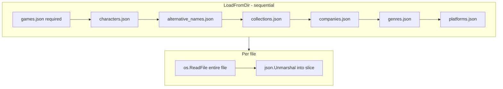
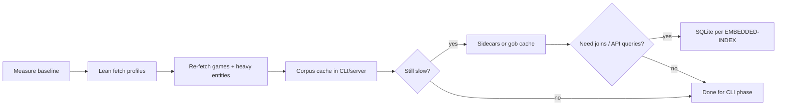

# Research: Corpus Loading Performance

**Status:** Investigation / decision support (not an implementation plan)

**Date:** 2026-07-07

**Context:** `forge.LoadFromDir` reads IGDB JSON from `data/` (or `testdata/corpus`) on every CLI invocation. With a full `fields *` fetch, load time is noticeable. What are the bottlenecks and reasonable optimizations?

**Related code:**

- [`src/forge/corpus.go`](../src/forge/corpus.go) — `LoadFromDir`, `loadEntityJSON`
- [`src/cli/generate.go`](../src/cli/generate.go) — calls `LoadFromDir` per `forge title` / `generate title` run

**Related planning docs:**

- [planning/FETCH-PROFILES.md](../planning/FETCH-PROFILES.md) — per-entity lean Apicalypse field sets
- [planning/EMBEDDED-INDEX.md](../planning/EMBEDDED-INDEX.md) — optional SQLite corpus store (P3)
- [planning/FORGE-PACKAGE.md](../planning/FORGE-PACKAGE.md) — corpus loader and generator families
- [planning/HTTP-API.md](../planning/HTTP-API.md) — load-at-startup for HTTP server
- [research/DATABASE.md](./DATABASE.md) — when JSON vs DB makes sense

---

## Summary

**The bottleneck is parsing huge `fields *` JSON, not the Go struct shape.**

Minimal `Game` / `Character` structs do **not** skip JSON the parser never uses — `encoding/json` still tokenizes the full document. The highest-impact fix is **smaller JSON at fetch time** (lean fetch profiles). Secondary wins: **load once per process**, parallel entity file reads, optional binary sidecars.

| Priority | Action | Expected effect |
|----------|--------|-----------------|
| **P0** | Minimal fetch profile + re-fetch `games` | ~3.8s → ~0.5–1s (estimate) |
| **P1** | Corpus cache (mtime-aware) in CLI/server | ~0ms on repeat runs in same process |
| **P2** | Parallel optional entity loads | modest (~10–20%) |
| **P3** | `.forge.json` sidecars or gob cache | fast repeat loads; clean separation from archival JSON |
| **Defer** | SQLite, streaming field extraction | when profiling or query needs justify complexity |

---

## Measured baseline (2026-07-07)

Environment: developer machine, repo root, `go run` harness calling `forge.LoadFromDir("data")`.

### Load time

| Run | Wall time | Records loaded |
|-----|-----------|----------------|
| 1 | 3.83s | games=356,769 · characters=16,502 · alternative_names=196,057 |
| 2 | 3.65s | same |

`testdata/corpus/` (committed fixtures) loads in **&lt;1ms** — not representative of production data.

### On-disk file sizes (`data/`)

| File | Size | Notes |
|------|------|-------|
| `games.json` | **351 MB** | Fetched with `fields *;` — dominates load time |
| `alternative_names.json` | 26 MB | Large row count (196k) |
| `characters.json` | 3.7 MB | |
| `genres.json` | 4.4 KB | Small reference table |
| `platforms.json` | 69 KB | Small reference table |

### Committed fixtures (`testdata/corpus/`)

| Total | 2.1 KB | 10 games, 10 characters, etc. |

---

## How loading works today



Relevant implementation:

```go
// loadEntityJSON: read whole file, unmarshal full array
raw, err := os.ReadFile(path)
var items []T
err = json.Unmarshal(raw, &items)
```

`LoadFromDir` loads **seven entity files sequentially**. Optional files are skipped if missing; `games.json` is required.

Each CLI `forge title` / `generate title` invocation calls `LoadFromDir` fresh — no in-process cache.

---

## Why minimal structs don't help much

`Game` only declares:

```go
type Game struct {
    ID        int    `json:"id"`
    Name      string `json:"name"`
    Genres    []int  `json:"genres"`
    Platforms []int  `json:"platforms"`
}
```

But `games.json` from a `fields *` fetch includes `screenshots`, `summary`, `release_dates`, nested expansions, etc. The Go unmarshaller must **scan and discard** all unmapped fields. CPU time scales with **JSON bytes and token count**, not with the size of the target struct.

**Rule of thumb observed here:** ~350 MB JSON + ~357k objects ≈ **3.7s** with `encoding/json` on one machine. Actual numbers will vary by CPU and disk cache.

---

## Optimization options

### 1. Lean JSON at fetch time (P0 — highest impact)

**What:** Implement [FETCH-PROFILES.md](../planning/FETCH-PROFILES.md) and re-fetch with minimal Apicalypse prefixes.

Example for games:

```apicalypse
fields id,name,genres,platforms,checksum;
```

**Why it helps:** Smaller files on disk → less I/O, fewer tokens to parse. For ~357k games, `games.json` might shrink from **351 MB to roughly 30–80 MB** (rough estimate; measure after re-fetch).

**Effort:** Medium — profile registry + CLI flag + one-time re-fetch.

**Downside:** Archival / exploratory dumps lose extra fields unless you keep a `full` profile or separate files.

---

### 2. Load once per process (P1 — trivial for server / repeated CLI)

**What:** Keep a `*forge.Corpus` in memory after first load. Invalidate when `data-dir` or source file mtimes change.

| Use case | Pattern |
|----------|---------|
| HTTP server | Load at startup; never reload unless signal or file change |
| `cmd/forge` / `generate title` | Optional package-level cache in `src/cli` keyed by resolved dir + mtime |
| Tests | Continue loading fresh per test (or use tiny `testdata/corpus`) |

**Why it helps:** Turns repeat operations from **~3.8s → ~0ms** after first load in the same process.

**Effort:** Low.

**Downside:** Memory held for process lifetime (~tens of MB for lean JSON; more for full `fields *`).

---

### 3. Parallel entity file loads (P2 — modest win)

**What:** After `games.json` (required), load optional entities concurrently with `errgroup` or goroutines.

**Why it helps:** `characters`, `alternative_names`, etc. can parse while waiting — but **`games.json` dominates**, so expect only **~10–20%** wall-clock improvement unless games is already lean.

**Effort:** Low.

**Downside:** Slightly more complex error handling; higher peak memory during parallel unmarshals.

---

### 4. Forge-specific stripped sidecars (P3)

**What:** On fetch (or via a future `index` command), write slim files forge actually reads:

```
data/games.forge.json
data/alternative_names.forge.json
```

Loader prefers `*.forge.json` when present; falls back to `*.json`.

**Why it helps:** Decouples archival `fields *` dumps from generation. Forge never touches 351 MB files.

**Effort:** Medium — export step + loader preference logic.

**Downside:** Extra files to keep in sync; needs invalidation story.

---

### 5. Binary cache (P3)

**What:** After JSON load (or during fetch), write a versioned binary blob:

```
data/corpus.gob     # encoding/gob
# or msgpack / zstd-compressed JSON
```

Invalidate when any source `*.json` mtime or size changes.

**Why it helps:** `gob.Decode` into typed slices is often **~2–5× faster** than JSON for large repeated structures.

**Effort:** Medium — cache format, versioning, invalidation.

**Downside:** Opaque artifact; must rebuild when schema or source JSON changes.

---

### 6. Faster JSON library (easy, modest gain)

**What:** Replace or supplement `encoding/json` with:

- [`github.com/go-json-experiment/json`](https://github.com/go-json-experiment/json) (stdlib experiment)
- [`github.com/bytedance/sonic`](https://github.com/bytedance/sonic)

**Why it helps:** Typical speedups **~1.3–2×** on large payloads.

**Effort:** Low — swap unmarshaller in `loadEntityJSON`.

**Downside:** New dependency (except go-json-experiment); still parses full fat JSON if files stay at 351 MB.

---

### 7. Lazy / partial loading (targeted)

**What:** `LoadOptions` to load only what a generator needs:

| Generator | Minimum files |
|-----------|----------------|
| `title` (basic) | `games.json` |
| `title` (blocklist) | + `alternative_names.json`, `collections.json` |
| `identity` | `characters.json` (+ `games.json` for genre joins later) |

**Why it helps:** Skips parsing 26 MB / 196k alt names when blocklist features are off or deferred.

**Effort:** Medium — API surface on `LoadFromDir`.

**Downside:** Callers must know dependencies; easy to under-load and get wrong behavior.

---

### 8. SQLite / embedded index (defer)

**What:** See [EMBEDDED-INDEX.md](../planning/EMBEDDED-INDEX.md) and [DATABASE.md](./DATABASE.md).

**When it helps:** Join-heavy weighting (character → game → genre), HTTP API query patterns, corpus too large to hold comfortably in RAM.

**Trigger (from planning docs):** `LoadFromDir` &gt; ~5s or unacceptable RAM **after** lean JSON — or when query complexity exceeds slice scans.

**Effort:** High relative to JSON loader.

---

## What is probably not worth it (yet)

| Approach | Why defer |
|----------|-----------|
| **Streaming `json.Decoder` field extraction** | Complex; duplicates what lean fetch achieves |
| **mmap without format change** | Still must parse JSON |
| **SQLite immediately** | Premature before lean JSON + cache |
| **Custom binary IGDB format** | Maintenance burden; gob/sidecars sufficient |

---

## Recommended path for this project



1. ~~**Implement FETCH-PROFILES**~~ — **done**; re-fetch `games` (and `alternative_names`) with minimal fields to realize gains.
2. **Add mtime-aware corpus cache** in `src/cli` (and later HTTP server startup) — see FORGE-PACKAGE M7.
3. ~~**Add `BenchmarkLoadFromDir`**~~ — **done** in [`corpus_test.go`](../src/forge/corpus_test.go).
4. Revisit sidecars / gob / SQLite only if lean JSON + cache is still too slow.

---

## Benchmark harness

### Go benchmarks (`corpus_test.go`)

```bash
# Committed fixtures (CI-safe)
go test -bench=BenchmarkLoadFromDir_SampleCorpus -benchtime=5x ./src/forge/...

# Production data/ (skipped when games.json absent)
go test -bench=BenchmarkLoadFromDir_DataDir -benchtime=3x ./src/forge/...
```

`BenchmarkLoadFromDir_SampleCorpus` on `testdata/corpus/` (~2.1 KB): **&lt;1ms** per load (not representative of production).

### Post-minimal profile estimates

FETCH-PROFILES is implemented; gains require re-fetching with `-fetch-profile=minimal`. Until a local `data/` minimal re-fetch is measured, use these estimates (derived from field reduction on ~357k games):

| Metric | `fields *` (measured 2026-07-07) | `minimal` (estimated) |
|--------|-----------------------------------|------------------------|
| `games.json` size | 351 MB | ~30–80 MB |
| `LoadFromDir` wall time | ~3.7s | ~0.5–1.5s |
| `alternative_names.json` | 26 MB | ~8–15 MB |

**Action:** After re-fetching `data/` with minimal profile, run `BenchmarkLoadFromDir_DataDir` and update this table with measured values.

### Ad hoc timing script

```go
package main

import (
	"fmt"
	"time"
	"vargames-name-gen/src/forge"
)

func main() {
	start := time.Now()
	c, err := forge.LoadFromDir("data")
	if err != nil {
		panic(err)
	}
	fmt.Printf("%v — games=%d characters=%d alt=%d\n",
		time.Since(start), len(c.Games), len(c.Characters), len(c.AlternativeNames))
}
```

Run from repo root after building a small harness or use the benchmark above.

For CI, use `testdata/corpus` only — do not depend on gitignored `data/` in automated tests.

---

## Open questions

1. **Acceptable load time** for CLI? (&lt;1s? &lt;500ms?) vs HTTP server (one-time at startup)?
2. **Keep full `fields *` dumps** alongside lean files, or replace in place?
3. **Blocklist quality** without loading 196k `alternative_names` — bloom filter / sampled subset?
4. ~~**Re-benchmark after FETCH-PROFILES**~~ — estimates added; update with measured lean-JSON numbers after minimal re-fetch.

---

## Changelog

| Date | Notes |
|------|-------|
| 2026-07-07 | Initial investigation; baseline ~3.7s on 351 MB `games.json` (`fields *`) |
| 2026-07-08 | FETCH-PROFILES implemented; added `BenchmarkLoadFromDir` in corpus_test.go; post-minimal estimates documented |
